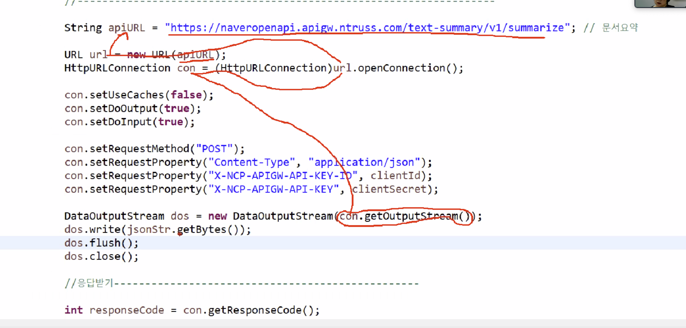

# Naver Cloud Platform API : Summary

> Thu Aug 18, 2022

---

[toc]

[Clova Summary](https://api.ncloud-docs.com/docs/ai-naver-clovasummary)

이번에는 다양한 주제의 원문(문서)으로부터 핵심 문장을 추출하여 1~2줄로 요약하는 서비스를 사용해봅시다.


#### home.jsp 

```jsp
<li><a href="/clova/summary">Clova Summary : 다양한 주제의 원문(문서)으로부터 핵심 문장을 추출하여 1~2줄로 요약하는 서비스</a></li>
```


#### Clova04_summary_controller.java

```java
package com.cali.clova.controller;

import org.springframework.stereotype.Controller;
import org.springframework.web.bind.annotation.RequestMapping;

@Controller
public class Clova04_summary_controller {
	
	@RequestMapping("/clova/summary")
	public String summary() {
		return "clova/summary";
	}
}

```


#### summary.jsp

```jsp
<%@ page language="java" contentType="text/html; charset=UTF-8" pageEncoding="UTF-8"%>
<%@ taglib uri="http://java.sun.com/jsp/jstl/core" prefix="c" %>
<!DOCTYPE html>
<html>
<head>
<meta charset="UTF-8">
<title>Insert title here</title>
<script src="https://cdnjs.cloudflare.com/ajax/libs/jquery/3.6.0/jquery.min.js"></script>
<script>
	$(function(){
		$("#summaryStart").click(function(){
			if($("#title").val()=="" || $("#content").val()==""){
				alert("제목과 글내용을 입력하세요.");
				return false;
			}
			
			$.ajax({
				type : "post",
				dataType : "text",
				async : false,
				url : "/clova/summaryOk",
				data : {
					title : $("#title").val(),
					content : $("#content").val()
				},
				success : function(result){
					
				}, error : function(e){
					console.log(e.responseText);
				}
			});
		});
	});
</script>
</head>
<body>
<h2>긴 문서를 요약하여 핵심 문장을 알려주는 문서 요약 API</h2>
제목 : <input type="text" name="title" id="title" value="'하루 2000억' 판 커지는 간편송금 시장" style="width:100%"/><br/>
글내용 : <textarea name="content" id="content" style="width:100%; height:200px;">간편송금 이용금액이 하루 평균 2000억원을 넘어섰다. 한국은행이 17일 발표한 '2019년 상반기중 전자지급서비스 이용 현황'에 따르면 올해 상반기 간편송금서비스 이용금액(일평균)은 지난해 하반기 대비 60.7% 증가한 2005억원으로 집계됐다. 같은 기간 이용건수(일평균)는 34.8% 늘어난 218만건이었다. 간편 송금 시장에는 선불전자지급서비스를 제공하는 전자금융업자와 금융기관 등이 참여하고 있다. 이용금액은 전자금융업자가 하루평균 1879억원, 금융기관이 126억원이었다. 한은은 카카오페이, 토스 등 간편송금 서비스를 제공하는 업체 간 경쟁이 심화되면서 이용규모가 크게 확대됐다고 분석했다. 국회 정무위원회 소속 바른미래당 유의동 의원에 따르면 카카오페이, 토스 등 선불전자지급서비스 제공업체는 지난해 마케팅 비용으로 1000억원 이상을 지출했다. 마케팅 비용 지출규모는 카카오페이가 491억원, 비바리퍼블리카(토스)가 134억원 등 순으로 많았다.</textarea><br/>
<input type="button" value="문서요약" id="summaryStart"/> <!-- ajax 를 사용하기 때문에 버튼으로 해도 된다. -->
<hr/>
<textarea id="resultText" style="width:100%; height:200px;"></textarea>
<div id="resultString"></div>
</body>
</html>
```


맵핑주소 /clova/summaryOk 로 넘겨줍니다.

#### Clova04_summary_controller.java

summaryOk 에서 보낸 데이터를 받아줘야합니다. 

```java
package com.cali.clova.controller;

import java.io.BufferedReader;
import java.io.DataOutputStream;
import java.io.File;
import java.io.FileInputStream;
import java.io.InputStreamReader;
import java.io.OutputStream;
import java.io.OutputStreamWriter;
import java.io.PrintWriter;
import java.net.HttpURLConnection;
import java.net.URL;
import java.net.URLConnection;

import org.json.JSONObject;
import org.springframework.stereotype.Controller;
import org.springframework.web.bind.annotation.RequestMapping;
import org.springframework.web.bind.annotation.RequestMethod;
import org.springframework.web.bind.annotation.RequestParam;

@Controller
public class Clova04_summary_controller {
	
	@RequestMapping("/clova/summary")
	public String summary() {
		return "clova/summary";
	}
	
	@RequestMapping(value="/clova/summaryOk", method=RequestMethod.POST)
	public String summaryOk(@RequestParam("title") String title, @RequestParam("content") String content) {
		
		// api 가져오기
		////////////////////////////////////////////////////////////
		StringBuffer reqStr = new StringBuffer();
        String clientId = "";//애플리케이션 클라이언트 아이디값"; * AI Naver API 의 Application 인증번호에서 복사해오기
        String clientSecret = "";//애플리케이션 클라이언트 시크릿값"; * AI Naver API 의 Application 인증번호에서 복사해오기
        
        BufferedReader br = null; // * 전송받은 정보가 있는 inputStream
        StringBuffer response = new StringBuffer(); 
        //String filename = null; // 업로드한 파일명 & 나중에 네이버 클라우드로 보낼 파일명

        try {
        	// 클라우드로 보낼 데이터를 준비한다.
        	// 자바에서 JSON 파일로 객체를 만든다. 
        	JSONObject document = new JSONObject();
        	document.put("title", title);
        	document.put("content", content); // key, value
        	
        	JSONObject option = new JSONObject();
        	option.put("language", "ko");
        	option.put("model", "news");
        	option.put("tone", 1);
        	option.put("summaryCount", 3);
        	
        	JSONObject body = new JSONObject(); // 네이버클라우드에 body 를 보낸다.
        	body.put("document", document);
        	body.put("option", option);
        	
        	String jsonStr = body.toString(); // {"document":{"title":"dsafsd",...}}
        	System.out.println("jsonStr->"+ jsonStr);
        	
        	// ------------------------------
            String apiURL = "https://naveropenapi.apigw.ntruss.com/text-summary/v1/summarize"; // 문서요약 summary url 주소
            URL url = new URL(apiURL); // url 객체생성
            HttpURLConnection con = (HttpURLConnection)url.openConnection(); // url open 
            con.setUseCaches(false);
            con.setDoOutput(true);
            con.setDoInput(true);
           
            // 전송을 POST 방식으로
            con.setRequestMethod("POST");
            // request  
            con.setRequestProperty("Content-Type", "application/json");
            con.setRequestProperty("X-NCP-APIGW-API-KEY-ID", clientId);
            con.setRequestProperty("X-NCP-APIGW-API-KEY", clientSecret);
            
         
            // 데이터를 보내기
            DataOutputStream dos = new DataOutputStream(con.getOutputStream());
            dos.write(jsonStr.getBytes()); // jsonStr 을 바이트 배열로
            dos.flush();
            dos.close();
            
            // -------------- 데이터 보내기 끝
            
            // -------------- 응답 받기
            
            int responseCode = con.getResponseCode(); // 정상적으로 받았으면 responseCode 에 담아서
            if(responseCode==200) { // 정상 호출
                br = new BufferedReader(new InputStreamReader(con.getInputStream())); // * 네이버 서버에서 돌아온 값을 input 으로 받기
            } else {  // 오류 발생
                System.out.println("error!!!!!!! responseCode= " + responseCode);
                br = new BufferedReader(new InputStreamReader(con.getInputStream()));
            }
            // * 전송받은 InputStream 의 값을 읽어내기
            String inputLine;
            if(br != null) {
                while ((inputLine = br.readLine()) != null) {
                    response.append(inputLine); // * 데이터가 response 에 담겨져 있는 상태
                }
                br.close();

            } 

        } catch (Exception e) {
            System.out.println(e);
        }
        /////
        System.out.println("summary->" + response.toString());
		return null;
	}
}

```


