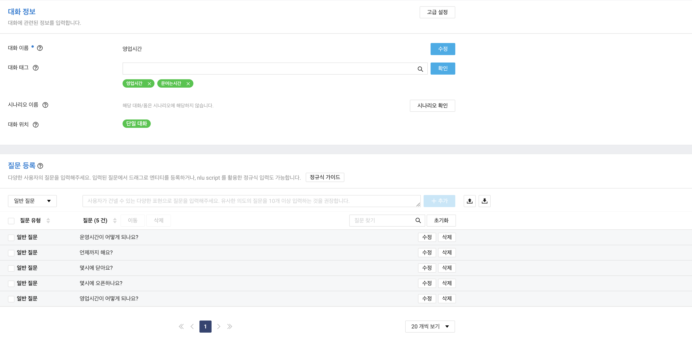
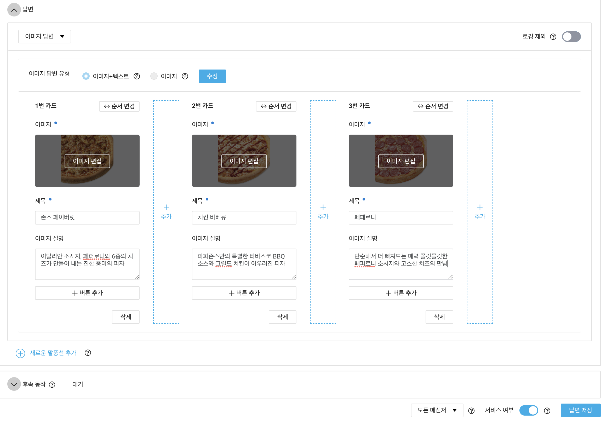

# Naver Cloud Platform API : Chatbot

> Wed Aug 24, 2022

---


챗봇을 사용하기 위해서는 시나리오가 필요합니다.

[CLOVA Chatbot](https://www.ncloud.com/product/aiService/chatbot)

[정규식 입력방법](https://guide.ncloud-docs.com/docs/ko/chatbot-chatbot-3-7)

[CLOVA Chatbot API Guide](https://api.ncloud-docs.com/docs/ai-application-service-chatbot)


콘솔로 들어가서 대화목록을 추가합니다.




답변으로 이미지 옵션을 추가할 수 있습니다.




Console > API Gateway 로 가서 API Keys 를 하나 생성하고

다시 빌더로 돌아와서 메신저 연동 > Custom > 자동연동을 설정합니다. 


#### home.jsp

```jsp
<li><a href="/clova/chatbotForm">CLOVA Chatbot : 마케팅, 고객 응대 등 다양한 서비스에 활용할 수 있는 챗봇을 생성하는 서비스</a></li>
```


#### Clova09_chatbot_controller

```java
package com.cali.clova.controller;

import org.springframework.stereotype.Controller;
import org.springframework.web.bind.annotation.GetMapping;

@Controller
public class Clova09_chatbot_controller {
	
	@GetMapping("/clova/chatbotForm")
	public String chatbotForm() {
		return "clova/chatbotForm";
	}
	
	
}

```


#### chatbotForm.jsp

```jsp
<%@ page language="java" contentType="text/html; charset=UTF-8" pageEncoding="UTF-8"%>
<%@ taglib uri="http://java.sun.com/jsp/jstl/core" prefix="c" %>
<!DOCTYPE html>
<html>
	<head>
		<meta charset="UTF-8">
		<title>Insert title here</title>
		<script src="https://cdnjs.cloudflare.com/ajax/libs/jquery/3.6.0/jquery.min.js"></script>
		<script>
			$(function(){
				$("#query").click(function(){
					if($("#queryin").val()!=""){ // 질문이 있을떄
						
						$.ajax({
							type: "post",
							dataType: "text",
							async: false,
							url: "/clova/chatbotOk",
							data: {
								queryin: $("#queryin").val()
							}, success: function(result){
								
								$("#jsonCode").val(result);
								
							}, error: function(){
								console.log(e.responseText);
							}
						
						});
					}
					
				});
			});
		</script>
	</head>
<body>
<h2>Chatbot</h2>
<div id="content" style="width:100%; height:400px; border:1px solid #ddd;"></div>
<input type="text" name="queryin" id="queryin"/>
<input type="button" value="query" id="query"/>
<hr/>
<textarea id="jsonCode" style="width:100%; height:300px;"></textarea>
</body>
</html>
```


#### Clova09_chatbot_controller

```java
package com.cali.clova.controller;

import java.io.BufferedReader;
import java.io.DataOutputStream;
import java.io.InputStreamReader;
import java.net.HttpURLConnection;
import java.net.URL;
import java.util.Date;

import javax.crypto.Mac;
import javax.crypto.spec.SecretKeySpec;

import org.json.JSONArray;
import org.json.JSONObject;
import org.springframework.stereotype.Controller;
import org.springframework.web.bind.annotation.GetMapping;
import org.springframework.web.bind.annotation.PostMapping;
import org.springframework.web.bind.annotation.RequestParam;
import org.springframework.web.bind.annotation.ResponseBody;

import android.util.Base64;

@Controller
public class Clova09_chatbot_controller {
	String apiURL = "";
	String secretKey = "";
	
	@GetMapping("/clova/chatbotForm")
	public String chatbotForm() {
		return "clova/chatbotForm";
	}
	
	@PostMapping("/clova/chatbotOk")
	@ResponseBody // ajax 이기 때문에 필요
	public String chatbotOk(@RequestParam("queryin") String queryin) {
		
		 /////////////////////////////////
		 String chatbotMessage = "";

	        try {
	            //String apiURL = "https://ex9av8bv0e.apigw.ntruss.com/custom_chatbot/prod/";

	            URL url = new URL(apiURL); // ** apiURL 멤버에 선언

	            String message = getReqMessage(queryin);
	            System.out.println("##" + message);

	            String encodeBase64String = makeSignature(message, secretKey); // ** secretKey 멤버에 선언

	            HttpURLConnection con = (HttpURLConnection)url.openConnection();
	            con.setRequestMethod("POST");
	            con.setRequestProperty("Content-Type", "application/json;UTF-8");
	            con.setRequestProperty("X-NCP-CHATBOT_SIGNATURE", encodeBase64String);

	            // post request
	            con.setDoOutput(true);
	            DataOutputStream wr = new DataOutputStream(con.getOutputStream());
	            wr.write(message.getBytes("UTF-8"));
	            wr.flush();
	            wr.close();
	            int responseCode = con.getResponseCode();

	            BufferedReader br;

	            if(responseCode==200) { // Normal call
	                System.out.println(con.getResponseMessage());

	                BufferedReader in = new BufferedReader(new InputStreamReader(con.getInputStream()));
	                String decodedString;
	                while ((decodedString = in.readLine()) != null) {
	                    chatbotMessage = decodedString;
	                }
	                //chatbotMessage = decodedString;
	                in.close();

	            } else {  // Error occurred
	                chatbotMessage = con.getResponseMessage();
	            }
	        } catch (Exception e) {
	            System.out.println(e);
	        }
	        
	    /////////////////////////////////
		
	    System.out.println("chatbotMessage->"+chatbotMessage);
		return chatbotMessage;
	}
	// --------------------
	 public static String makeSignature(String message, String secretKey) {

	        String encodeBase64String = "";

	        try {
	            byte[] secrete_key_bytes = secretKey.getBytes("UTF-8");

	            SecretKeySpec signingKey = new SecretKeySpec(secrete_key_bytes, "HmacSHA256");
	            Mac mac = Mac.getInstance("HmacSHA256");
	            mac.init(signingKey);

	            byte[] rawHmac = mac.doFinal(message.getBytes("UTF-8"));
	            encodeBase64String = Base64.encodeToString(rawHmac, Base64.NO_WRAP);

	            return encodeBase64String;

	        } catch (Exception e){
	            System.out.println(e);
	        }

	        return encodeBase64String;

	    }
	
	// --------------------
	 public static String getReqMessage(String voiceMessage) {

	        String requestBody = "";

	        try {

	            JSONObject obj = new JSONObject();

	            long timestamp = new Date().getTime();

	            System.out.println("##"+timestamp);

	            obj.put("version", "v2");
	            // obj.put("userId", "U47b00b58c90f8e47428af8b7bddc1231heo2");
	            obj.put("userid", "66d793e7eb5c4f909eec86356bc33092");
	//=> userId is a unique code for each chat user, not a fixed value, recommend use UUID. use different id for each user could help you to split chat history for users.

	            obj.put("timestamp", timestamp);

	            JSONObject bubbles_obj = new JSONObject();

	            bubbles_obj.put("type", "text");

	            JSONObject data_obj = new JSONObject();
	            data_obj.put("description", voiceMessage);

	            bubbles_obj.put("type", "text");
	            bubbles_obj.put("data", data_obj);

	            JSONArray bubbles_array = new JSONArray();
	            bubbles_array.put(bubbles_obj);

	            obj.put("bubbles", bubbles_array);
	            obj.put("event", "send");

	            requestBody = obj.toString();

	        } catch (Exception e){
	            System.out.println("## Exception : " + e);
	        }

	        return requestBody;

	    }
}

```


여기까지 작성이 끝났으면 chatbot 빌더로 가서 빌드를 진행합니다.

> 빌드를 한번 할때마다 요금이 청구되니 주의해서 하기 바랍니다.


#### chatbotForm.jsp

```jsp
<%@ page language="java" contentType="text/html; charset=UTF-8" pageEncoding="UTF-8"%>
<%@ taglib uri="http://java.sun.com/jsp/jstl/core" prefix="c" %>
<!DOCTYPE html>
<html>
	<head>
		<meta charset="UTF-8">
		<title>Insert title here</title>
		<script src="https://cdnjs.cloudflare.com/ajax/libs/jquery/3.6.0/jquery.min.js"></script>
		<style>
			#content{
				overflow: scroll;
			}
			#content ul, #content li{
				margin: 0; 
				padding: 0;
				list-style-type: none;
			}
			#content ul{
				overflow: auto;
			}
			#content li{
				float: left;
				padding: 10px;
				width: 200px;
			}
			#content li>img{
				width:200px;
				height: 200px;
			}
		</style>
		<script>
			$(function(){
				$(document).on('click', '#query', function(){
					
					if($("#queryin").val()!=""){ // 질문이 있을떄
						
						$.ajax({
							type: "post",
							dataType: "text",
							async: false,
							url: "/clova/chatbotOk",
							data: {
								queryin: $("#queryin").val()
							}, success: function(result){
							
								$("#jsonCode").val(result); // 화면에 출력
								
								var jsonData = JSON.parse(result); // json 으로 변환
								//console.log(jsonData);
								// 텍스트로 답변이 왔을 경우
								if(jsonData.bubbles[0].type=="text"){
									var ans = jsonData.bubbles[0].data.description;
									ans = ans.replaceAll("\n", "<br/>"); // \을 <br/> 태그로 바꾸기
									$("#content").append("<p>" + ans + "</p>");
								}else if(jsonData.bubbles[0].type=="template"){ // 버튼형식의 답변일때
									var msg = jsonData.bubbles[0].data.cover.data.description;
									
									var tag = "";
									// $("#content").append("<p><b>"+ msg + "</b></p>");
									tag += "<p><b>" + msg + "</b><br/>";
									
									jsonData.bubbles[0].data.contentTable.map(function(btn, idx){
										//console.log(btn);
										//console.log(idx);
										tag += "<input type='button' value='"+btn[0].data.title;
										tag += "' onclick=\"location.href=\'" + btn[0].data.data.action.data.url + "\'\" style='width:100%;'/><br/>";
									});
									tag += "</p>";
									
									$("#content").append(tag);
								}else if(jsonData.bubbles[0].type=='carousel'){ // image 로 답변이 왔을 경우
									
									var imgView = "<ul>";
									
									jsonData.bubbles[0].data.cards.map(function(img, idx){
										console.log(img);
										imgView += "<li><br/>"
										imgView += "<b>" + img.data.cover.title + "</b></br>";
										imgView += img.data.cover.data.description + "</br>";
										imgView += "</li>";
									});
									imgView += "</ul>";
									$("#content").append(imgView);
									
								}
								// 스크롤바를 DIV 의 맨아래로 이동하기 : 제이쿼리 방법
								//$("#content").scrollTop($("#content")[0].scrollHeight);
								// 스크롤바를 DIV 의 맨아래로 이동하기 : 자바스크립트 방법
								var div = document.getElementById("content");
								div.scrollTop = div.scrollHeight;
								
								$("#queryin").val("");
								
								
							}, error: function(e){
								console.log(e.responseText);
							}
						
						});
					}
					
				});
			});
		</script>
	</head>
<body>
<h2>Chatbot</h2>
<div id="content" style="width:100%; height:400px; border:1px solid #ddd;"></div>
<input type="text" name="queryin" id="queryin"/>
<input type="button" value="query" id="query"/>
<hr/>
<textarea id="jsonCode" style="width:100%; height:300px;"></textarea>
</body>
</html>
```


#### Clova09_chatbot_controller

```java
package com.cali.clova.controller;

import java.io.BufferedReader;
import java.io.DataOutputStream;
import java.io.InputStreamReader;
import java.net.HttpURLConnection;
import java.net.URL;
import java.util.Date;

import javax.crypto.Mac;
import javax.crypto.spec.SecretKeySpec;

import org.json.JSONArray;
import org.json.JSONObject;
import org.springframework.stereotype.Controller;
import org.springframework.web.bind.annotation.GetMapping;
import org.springframework.web.bind.annotation.PostMapping;
import org.springframework.web.bind.annotation.RequestParam;
import org.springframework.web.bind.annotation.ResponseBody;

import android.util.Base64;

@Controller
public class Clova09_chatbot_controller {
	String apiURL = "";
	String secretKey = "";
	
	@GetMapping("/clova/chatbotForm")
	public String chatbotForm() {
		return "clova/chatbotForm";
	}
	
	@PostMapping("/clova/chatbotOk")
	@ResponseBody // ajax 이기 때문에 필요
	public String chatbotOk(@RequestParam("queryin") String queryin) {
		
		 /////////////////////////////////
		 String chatbotMessage = "";

	        try {
	            //String apiURL = "https://ex9av8bv0e.apigw.ntruss.com/custom_chatbot/prod/";

	            URL url = new URL(apiURL); // ** apiURL 멤버에 선언

	            String message = getReqMessage(queryin);
	            System.out.println("##" + message);

	            String encodeBase64String = makeSignature(message, secretKey); // ** secretKey 멤버에 선언

	            HttpURLConnection con = (HttpURLConnection)url.openConnection();
	            con.setRequestMethod("POST");
	            con.setRequestProperty("Content-Type", "application/json;UTF-8");
	            con.setRequestProperty("X-NCP-CHATBOT_SIGNATURE", encodeBase64String);

	            // post request
	            con.setDoOutput(true);
	            DataOutputStream wr = new DataOutputStream(con.getOutputStream());
	            wr.write(message.getBytes("UTF-8"));
	            wr.flush();
	            wr.close();
	            
	            int responseCode = con.getResponseCode();
	            System.out.println("responseCode=>"+ responseCode);
	            BufferedReader br;

	            if(responseCode==200) { // Normal call
	                System.out.println(con.getResponseMessage());

	                BufferedReader in = new BufferedReader(new InputStreamReader(con.getInputStream()));
	                String decodedString;
	                while ((decodedString = in.readLine()) != null) {
	                    chatbotMessage = decodedString;
	                }
	                //chatbotMessage = decodedString;
	                in.close();

	            } else {  // Error occurred
	                chatbotMessage = con.getResponseMessage();
	            }
	        } catch (Exception e) {
	            System.out.println(e);
	        }
	        
	    /////////////////////////////////
		
	    System.out.println("chatbotMessage->"+chatbotMessage);
		return chatbotMessage;
	}
	// --------------------
	 public static String makeSignature(String message, String secretKey) {

	        String encodeBase64String = "";

	        try {
	            byte[] secrete_key_bytes = secretKey.getBytes("UTF-8");

	            SecretKeySpec signingKey = new SecretKeySpec(secrete_key_bytes, "HmacSHA256");
	            Mac mac = Mac.getInstance("HmacSHA256");
	            mac.init(signingKey);

	            byte[] rawHmac = mac.doFinal(message.getBytes("UTF-8"));
	            encodeBase64String = Base64.encodeToString(rawHmac, Base64.NO_WRAP);

	            return encodeBase64String;

	        } catch (Exception e){
	            System.out.println(e);
	        }

	        return encodeBase64String;

	    }
	
	// --------------------
	 public static String getReqMessage(String voiceMessage) {

	        String requestBody = "";

	        try {

	            JSONObject obj = new JSONObject();

	            long timestamp = new Date().getTime();

	            System.out.println("##"+timestamp);

	            obj.put("version", "v2");
	            obj.put("userId", "U47b00b58c90f8e47428af8b7bddc1231heo2");
	            //obj.put("userid", "66d793e7eb5c4f909eec86356bc33092");
	//=> userId is a unique code for each chat user, not a fixed value, recommend use UUID. use different id for each user could help you to split chat history for users.

	            obj.put("timestamp", timestamp);

	            JSONObject bubbles_obj = new JSONObject();

	            bubbles_obj.put("type", "text");

	            JSONObject data_obj = new JSONObject();
	            data_obj.put("description", voiceMessage);

	            bubbles_obj.put("type", "text");
	            bubbles_obj.put("data", data_obj);

	            JSONArray bubbles_array = new JSONArray();
	            bubbles_array.put(bubbles_obj);

	            obj.put("bubbles", bubbles_array);
	            obj.put("event", "send");

	            requestBody = obj.toString();

	        } catch (Exception e){
	            System.out.println("## Exception : " + e);
	        }

	        return requestBody;

	    }
}

```

