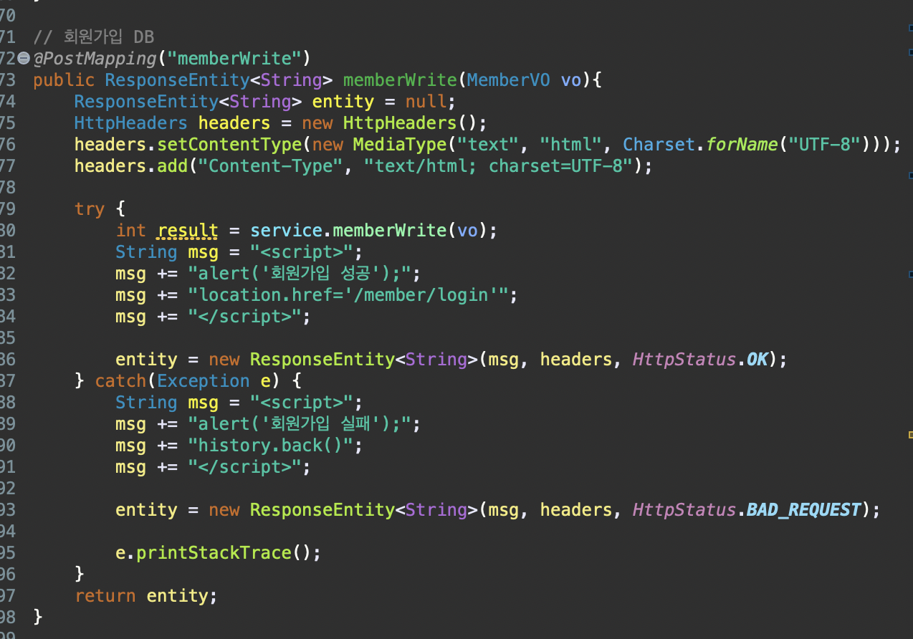

Q. 밑의 코드에서 ResponseEntity<String> 으로 리턴값을 받는 이유는? ResponseBody 와 차이는? Headers. 에서 setContentType 과 add 가 두번 들어간 이유는? Int result 가 int 의 데이터 값을 가지는 이유는?

* RestController에서는 ResponseBody를 보낼 수 있다.
* client에게 data와 view file을 담을 수 있는 객체이며, view page를 별도로 만들 필요가 없음.

