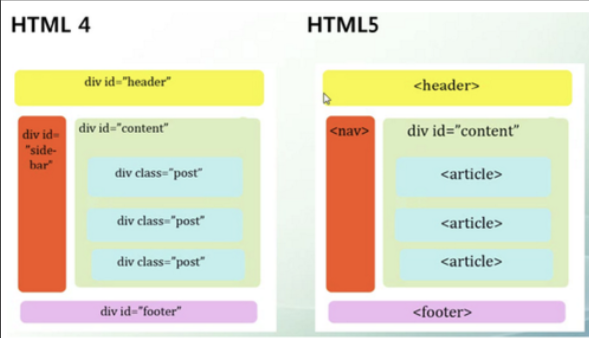

# Web Review


필답시험: 15문제 객관식

범위: 프론트앤드, 백앤드 (HTML, CSS, JavaScript, JQuery, Ajax, Jsp, JSTL, Spring)

과제 1 : 로그인 - 프로젝트 별도생성

과제 2 : 게시물리스트 - 프로젝트 별도생성

[toc]

### EL 표현식 

자바 코드가 들어가는 표현식을 좀 더 편리하게 사용하기 위한 표현 언어입니다.

EL(Expression Language)은 자바 빈의 프로퍼티, 값을 JSP의 표현식 <%= %>이나 액션 태그 <jsp:useBean> 를 사용하는것 보다 쉽고 간결하게 꺼낼수 있게 하는 기술이다. JSTL 과 주로 같이 사용합니다.

```
// 객체 프로퍼티 값을 꺼낼때 주로 사용
${표현식}

// 사용자 입력값을 객체의 프로퍼티에 담는 용도로 주로 사용
#{}
```

<c:if ---- > ${---}


<% %>에 session에서 객체를 가져오는 자바 코드를 작성하고 <%= %>를 사용하는 대신

```jsp
<%
	Student student = (Student) request.getAttribute("student");
%>
<html>
  <head>
    <title>학생정보</title>
  </head>
  <body>
    <form action="update" method="post">
      이름 : <input type='text' name='student_name' value='<%student.getStudentName()%>'
    </form>
  </body>
</html>
```

EL 표현식으로 바꾸면 다음과 같다.

```jsp
<html>
	<head>
  	<title>학생정보</title> 
  </head>
	<body>
    <form action='update' method='post'>
      이름 : <input type='text' name='student_name' value='${requestScope.student.studentName}'
    </form>
  </body>  
</html>
```


### a 태그

button 태그가 로그인처럼 특정한 액션을 위한 것이라면 a 태그는 어디론가 이동할때 (링크) 사용합니다.

```css
<a href = "주소" title="네이트로 가요" target="_blank">네이트</a>
```


### JavaScript 함수 생성하는 방법

```javascript
function 함수명(){
}

함수명()=>{
}

var a = 0 => { // 익명의 함수선언
}
```


### Semantic 태그

header, footer, nav, section, article, aside, body, thead, tfoot, main... 등 "의미가 있는 태그"라는 뜻의 HTML tag.




### Cookie, Session

웹에서 클라이언트측과 서버측에 정보를 저장할 수 있는 내장 객체


### jQuery 표기법

```javascript
$(document).ready(function(){
});

Jquery.ready(function(){
});

$(function(){
});

$(()=>{  
});
```


### CSS 선택자

```css
#board li:nth-child(6n+1){
}
```


### Controller

서버로 Request, view 페이지정보, 서버에서 클라이언트 정보보내기

실제 읽혀질때는 DAO 클래스에 의해서 입니다.

controller DB 작업을 하고 View 로 보냅니다. view , data 기능


### 유효성 검사

예를 들어 아이디, 비밀번호 확인하는것이죠. 

```javascript
if($(#userif).val()==""){
  alert("아이디를 입력하세요");
	$("#userid").focus(); // 입력칸으로 이동
	return false;
}

if(document.getElementById("userid").value.length<8 || document.getElementById("userid").value.length<12){
  alert("아이디를 입력하세요.");
  document.getElementById("userid").value="";
  document.getElementById("userid").focus();
  return false;
}
```


### ajax 표기법

```javascript
$.ajax({
	url: url,
	data: params,
	type: "GET",
	success: function(result){
		$("#view").append(result);
	},
	error: function(e){
		console.log(e.responseText);
	}
});
```


### 로그인 하기

```java
	// public ____ loginOk(String userid, String userpwd) {
	public ModelAndView loginOk(MemberVO vo, HttpSession session, HttpServletRequest request) { 
		// vo 를 매개변수로 사용하면 보낸 데이터변수와 같은 이름을 가진 변수에 자동으로 request 해준다.
		MemberVO resultVO = service.login(vo);
		
		// 아이디, 비밀번호가 있으면 아이디와 이름을 vo에 담아서 return
		// 없으면 null 이 return 된다.
		ModelAndView mav = new ModelAndView();
		
		if(resultVO==null) { // 로그인 실패
			mav.setViewName("redirect:login");
		}else { // 로그인 성공
			
			// session 기록
			// HttpSession session = request.getSession();
			session.setAttribute("logId", resultVO.getUserid());
			session.setAttribute("logName", resultVO.getUsername());
			session.setAttribute("logStatus", "Y");
			
			// 페이지 이동
			mav.setViewName("redirect:/");
		}
		return mav;
		
	}
```


### Mybatis 쿼리문 구현하는 방법

```xml
	<select id="boardList" resultType="com.california.myapp.vo.BoardVO">
		select no, subject, userid, hit, date_format(writedate, '%m-%d %H:%i') writedate 
		from board order by no desc
	</select>
```


1. 1, 2
2. 3
3. 1
4. 4
5. 2
6. 3
7. 4
8. 3
9. 1
10. 2
11. 4
12. 1
13. 2
14. 3
15. 1
