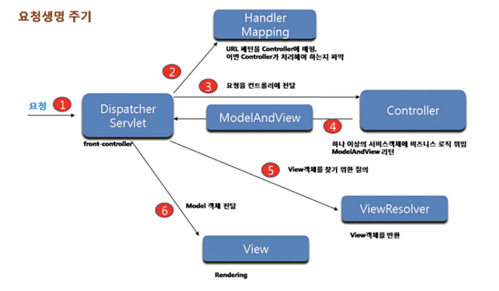

# Spring


[Spring Tool](https://github.com/spring-attic/toolsuite-distribution/wiki/Spring-Tool-Suite-3) 을 다운받습니다. 

workspaceSpring 로 directory 를 설정합니다.


New Spring Legacy Project

Project Name : SpringMybatisMysql

SpringMVC Project

top-level Package : kr.co.california


[메이븐저장소](https://mvnrepository.com/) 로 이동합니다.

Spring > Spring Context > 5.2.22.RELEASE

pom.xml 파일을 열어서 아래와 같이 수정합니다.

```xml
	<properties>
		<java-version>11</java-version>
		<org.springframework-version>5.2.22.RELEASE</org.springframework-version>
		<org.aspectj-version>1.6.10</org.aspectj-version>
		<org.slf4j-version>1.6.6</org.slf4j-version>
	</properties>
```

저장을 하면 Maven Dependencies 가 자동으로 수정된 내용으로 다운이 됩니다.


`/usr/local/apache-tomcat-9.0.64` 으로 서버를 설정합니다.

한국어를 보이게 하기 위해서 home.jsp 에 다음과 같이 지시부에 작성합니다.

`<%@ page language="java" contentType="text/html; charset=UTF-8" pageEncoding="UTF-8" %>`


`http://localhost:8080/california/` 으로 연결이 되었는지 확인합니다. 


### Spring MVC 흐름도




controller 를 만들어 보겠습니다.

src/main/java 하위에 kr.co.california.member 패키지를 생성후 MemberController.java 자바 클래스를 생성합니다.

