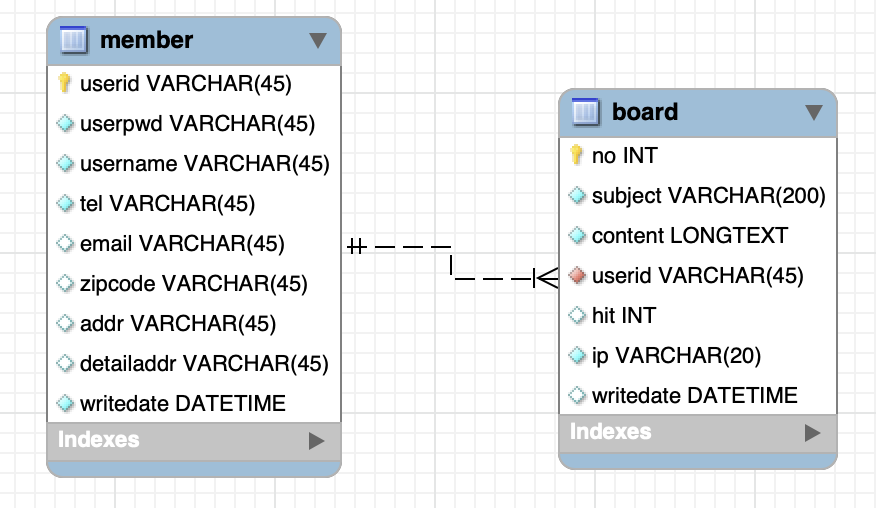

# 게시판

> Tue Jul 26, 2022

---


이번에는 로그인이 되었을때 작성할 수 있는 게시판을 만들어보겠습니다.

우선은 MySQL Workbench 에서 board 라는 테이블을 만들어 DB 작업을 준비합니다.





게시판 목록이 있고 글쓰기 링크를 걸어서 글쓰기 기능을 추가해봅시다. 글쓰기를 클릭하면 제목, 글내용, 글등록이 나와있는 페이지로 이동합니다. 목록에서 제목을 클릭하면 글 내용보기(번호, 글쓴이, 글내용, 수정, 삭제) 으로 이동합니다.  

글쓰기와 글수정은 성공시 게시판 목록으로 실패시 해당 글 화면에서 머물게 할겁니다.

삭제는 자바스크립트로 물어봐서 삭제를 하겠다고 하면 게시판 목록으로, 안하겠다고 하면 글 화면에서 머무르게 할 겁니다.


다시 STS 로 돌아와서 src>main>webapp>WEB-INF>views 에 board 라는 폴더를 만듭니다.

이제 controller, dao, service, vo 패키지에 자바클래스와 인터페이스를 만들어줍니다.

#### BoardController.java

```java
package com.california.myapp.controller;

import org.springframework.stereotype.Controller;

@Controller
public class BoardController {

}
```

#### BoardDAO.java

```java
package com.california.myapp.dao;

public interface BoardDAO {

}
```

#### BoardService.java

```java
package com.california.myapp.service;

public interface BoardService {

}
```

#### BoardServiceImpl.java

```java
package com.california.myapp.service;

import org.springframework.stereotype.Service;

@Service
public class BoardServiceImpl implements BoardService {

}
```

#### BoardVO.java

```java
package com.california.myapp.vo;

public class BoardVO {
	private int no;
	private String subject;
	private String content;
	private String userid;
	private int hit;
	private String ip;
	private String writedate;
	public int getNo() {
		return no;
	}
	public void setNo(int no) {
		this.no = no;
	}
	public String getSubject() {
		return subject;
	}
	public void setSubject(String subject) {
		this.subject = subject;
	}
	public String getContent() {
		return content;
	}
	public void setContent(String content) {
		this.content = content;
	}
	public String getUserid() {
		return userid;
	}
	public void setUserid(String userid) {
		this.userid = userid;
	}
	public int getHit() {
		return hit;
	}
	public void setHit(int hit) {
		this.hit = hit;
	}
	public String getIp() {
		return ip;
	}
	public void setIp(String ip) {
		this.ip = ip;
	}
	public String getWritedate() {
		return writedate;
	}
	public void setWritedate(String writedate) {
		this.writedate = writedate;
	}
	
}
```


게시판의 첫시작은 홈에서 게시판을 클릭하여 게시판목록으로 이동합니다. 이름을 boardList.jsp 로 설정합니다. 


Top.jspf 에서 게시판을 클릭하면 boardcontroller 로 이동하여 매핑을 하고 실행을 해줍니다. 

```jsp
<li><a href="board/list">게시판</a></li>
```


boardList.jsp 을 만들어줍니다. 