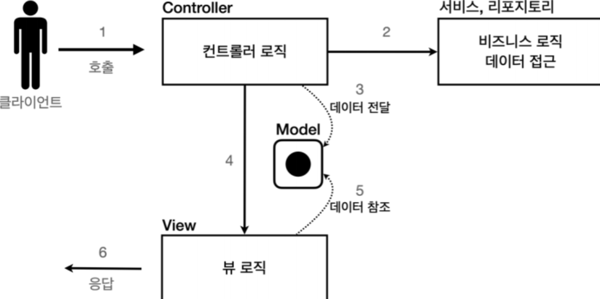

### Servlet 이란?

클라이언트의 요청을 처리하고, 그 결과를 반환하는 Servlet 클래스의 구현 규칙을 지킨 자바 웹 프로그래밍 기술입니다.

### MVC 패턴이란?

하나의 서블릿이나 JSP 로 처리하던 것을 컨트롤러와 뷰, 모델 영역으로 역할을 나눈 것을 말합니다.

컨트롤러는 HTTP 요청을 받아서 파라미터를 검증하고 비즈니스 로직을 실행합니다. 

그리고 뷰에 전달할 결과 데이터를 조회해서 모델에 담습니다.

모델은 뷰에 출력할 데이터를 담아둡니다.

뷰는 모델에 담겨있는 데이터를 사용해서 화면에 그리는 일을 하는데, HTML 을 생성하는 부분을 생각하시면 되요.

