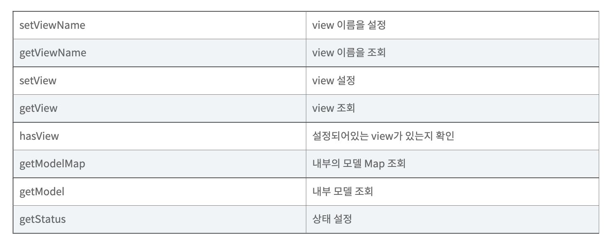

# Web : Springboot Basics

> Tue Aug 9

---


[toc]

### 웹 기본 구조


 


### Model 과 ModelAndView 의 차이는 무엇일까요?

> Controller 의 데이터를 Model 에 담고, 담겨있는 데이터를 화면에 View 해주는 기능

* ModelAndView 객체의 기능




### 1. Spring & Spring Boot 가 무엇인가요?

> 스프링은 웹개발을 하기 위해서 각종 도구와 기술이 집약되어 있는 프레임워크입니다.
>
> 개발자마다 코드의 구조가 너무 달라 협업하기가 힘들겠죠. 
>
> 프레임워크는 효율적인 코드 구조를 인도하는 하나의 Frame 안에서 Work 하는 것입니다.


**Spring Framework** 는 자바 플랫폼을 위한 오픈 소스 애플리케이션 프레임워크입니다. 

**Spring** 에 apache 서버를 장착하거나 bean 등록 등과 같이 불편한 일을 자동적으로 지원해주는 것이 **Spring Boot** 입니다.

프로그래밍을 하는 데 있어 매우 중요한 **비즈니스를 만들기 위한 프로그래밍**에 조금 더 에너지를 투입할 수 있게 Spring의 많은 부분을 자동화하였고, 많은 개발자들이 현재 Spring Boot을 이용하여 개발을 진행하고 있습니다.


Spring 에서 제공하는 대표적인 서비스는 다음과 같습니다.

1. Spring Container
2. Dependency Injection(DI)
3. ORM (Object Relational Mapping) 지원
4. AOP (Aspect Oriented Programming) 지원


#### 스프링의 특징

Spring의 특징들은 아래와 같습니다.

- Spring은 자바 객체와 라이브러리들을 관리해주며, 톰캣과 같은 WAS 가 내장되어 있어 자바 웹 어플리케이션을 구동할 수 있습니다.

- Spring은 경량 컨테이너로 자바 객체를 직접 Spring 안에서 관리합니다. 객체의 생성 및 소멸과 같은 생명 주기(Life cycle)을 관리하며, Spring 컨테이너에서 필요한 객체를 가져와 사용합니다.

- Spring의 가장 큰 특징으로 IOC와 DI 가 많이 언급됩니다. IOC와 DI의 간단한 개념은 아래와 같습니다.

  - ```plaintext
    제어의 역전 (IOC, Inversion Of Control)
    ```

    - 일반적으로 처음에 배우는 자바 프로그램에서는 **각 객체들이 프로그램의 흐름을 결정하고 각 객체를 직접 생성하고 조작하는 작업(객체를 직접 생성하여 메소드 호출)을 했습니다**. 즉, 모든 작업을 사용자가 제어하는 구조였습니다. 예를 들어 A 객체에서 B 객체에 있는 메소드를 사용하고 싶으면, B 객체를 직접 A 객체 내에서 생성하고 메소드를 호출합니다.
    - 하지만 **IOC가 적용된 경우, 객체의 생성을 특별한 관리 위임 주체에게 맡깁니다.** 이 경우 **사용자는 객체를 직접 생성하지 않고, 객체의 생명주기를 컨트롤하는 주체는 다른 주체**가 됩니다. 즉, 사용자의 제어권을 다른 주체에게 넘기는 것을 IOC(제어의 역전) 라고 합니다.
    - 요약하면 Spring의 Ioc란 `클래스 내부의 객체 생성 -> 의존성 객체의 메소드 호출`이 아닌, `스프링에게 제어를 위임하여 스프링이 만든 객체를 주입 -> 의존성 객체의 메소드 호출` 구조입니다. 스프링에서는 모든 의존성 객체를 스프링이 실행될때 만들어주고 필요한 곳에 주입해줍니다.

  - ```plaintext
    의존성 주입 (DI, Dependency Injection)
    ```

    - 어떤 객체(B)를 사용하는 주체(A)가 객체(B)를 직접 생성하는게 아니라 **객체를 외부(Spring)에서 생성해서 사용하려는 주체 객체(A)에 주입시켜주는 방식**입니다. 사용하는 주체(A)가 사용하려는 객체(B)를 직접 생성하는 경우 의존성(변경사항이 있는 경우 서로에게 영향을 많이 준다)이 높아집니다. 하지만, 외부(Spring)에서 직접 생성하여 관리하는 경우에는 A와 B의 의존성이 줄어듭니다.


### 2. 웹 기본 구조, 서블릿, HTTP

#### 웹 기본 구조

사용자와 서버로 나누어 생각해보자!

 

우리가 네이버에서 "뉴스" 버튼을 클릭하면 뉴스 화면으로 이동한다.

실제로 내부에서는 어떻게 이루어질까??

다음을 보면서 이해해보자!

 

1. 사용자가 "뉴스" 버튼을 클릭한다.
2. 사용자의 웹 브라우저가 요청 메시지를 보낸다. (ex. naver.com/news)
3. naver.com가 DNS (Domain Name System) 를 거쳐 naver의 ip주소로 변경되어 보내진다. (ex. 192.123.123/news)
4. 192.123.123/news 정보가 웹 애플리케이션 서버를 거쳐 http 메시지로 변경된다.
5. naver의 서블릿 컨테이너로 해당 http 메세지가 도착한다.
6. naver의 서블릿 컨테이너는 http 메세지를 읽고 그에 해당하는 내용을 사용자의 웹브라우저에게 돌려준다.
7. 사용자의 웹브라우저는 해당 내용을 읽고 사용자가 이용할 수 있게 변환해서 보여준다.


#### 서블릿

> 자바 서블릿은 웹사이트를 동적으로 생성하는 서버 측 프로그램 혹은 그 사양을 말합니다.
>
> 위의 예시는 웹 애플리케이션이 생성한 HTTP 메시지를 읽고 그에 해당하는 동작을 수행하는 naver 측의 java 프로그램입니다.


### 3. HttpServletRequest, HttpServletResponse

* WAS 가 웹브라우저로부터 Servlet 요청을 받으면
  * 요청을 받을 때 전달 받은 정보를 HttpServletRequest 객체를 생성하여 저장
  * 웹브라우저에게 응답을 돌려줄 HttpServletResponse 객체를 생성 (빈 객체)
  * 생성된 HttpServletRequest (정보가 저장된) 와 HttpServletResponse (비어있는) 를 Servlet 에게 전달
* HttpServletRequest
  * Http 프로토콜의 request 정보를 서블릿에게 전달하기 위한 목적으로 사용
  * Header 정보, Parameter, Cookie, URI, URL 등의 정보를 읽어들이는 메소드를 가진 클래스
  * Body 의 Stream 을 읽어들이는 메소드를 가지고 있음
* HttpServletResponse
  * Servlet 은 HttpServletResponse 객체에 Content Type, 응답코드, 응답메세지 등을 담아서 전송함


### 4. HTTP 이란?

> 1. 사용자가 ID 와 Password 를 입력하고 로그인 버튼을 누릅니다.
>
> 2. 서버로 로그인을 한다는 "요청"이 인터넷망을 통해서 넘어갑니다.
>
>    요청과 응답이 어떤 식으로 넘어 갈까요? 개발자들끼리 규약을 만들자구요!


#### HTTP

> HTTP 는 Protocol 입니다. 편지를 쓸때 To & From 을 넣는 형식과 비슷합니다. 
>
> 요청과 응답에 양식을 넣어 거기에 맞추어서 요청과 응답을 하도록 Protocol 을 만든겁니다.


#### HTTP Header

```bash
GET /apple?id=coca&password=123 HTTP/1.1
Content-Type: application/json
Content-Length:18
Content-Language: ko
Host: www.naver.com
```

* GET : HTTP 메서드를 표현한다.

- /apple : 해당 사이트에 요청하는 리소스

- ? : 리소스를 요청하며 함께 보내는 데이터의 시작

- id=coca&password=123 : id와 password를 보냄

- HTTP/1.1 : HTTP 버전


헤더에는 HTTP 전송에 필요한 부가정보가 포함되어있습니다.

바디 데이터에 대한 정보나, 바디 크기, 애플리케이션 정보, 캐시 정보 등등이 엄청나게 많습니다.


- Content-Type : 보내는 데이터의 미디어 타입과 문자 인코딩에 대한 정보이다.
  - text/html; charset-utf-8 : html 형식이라는 타입을 데이터로 이룰 때, 지정해주는 타입이다.
  - application/json : json 형태의 타입을 데이터로 이룰 때, 지정해주는 타입이다.
  - image/png : image 파일의 타입을 데이터로 이룰 때, 지정해주는 타입이다.


#### HTTP Method

>  GET, POST, PUT, DELETE, PATCH, CONNECT 

GET : 단순 조회를 요청하는 메서드입니다. 시작 라인에 명시되어있다.

POST : 수정을 요청하는 메서드이다.

최근에 HTTP 메서드를 기반으로 서버를 만드는 RestFulAPI가 유행하는 추세


#### HTTP Status

> 클라이언트가 요청을 보내었을 때, 서버 측에서 HTTP 응답이 온다.
>
> 여기서 성공, 실패, 처리 중, 클라이언트 에러, 서버 에러 등등 갖가지의 경우가 있다.


#### MVC 가 무엇인가요?

> Model, View, Controller


#### Reference

https://bestkingit.tistory.com/134?category=332453

https://melonicedlatte.com/2021/07/11/174700.html
