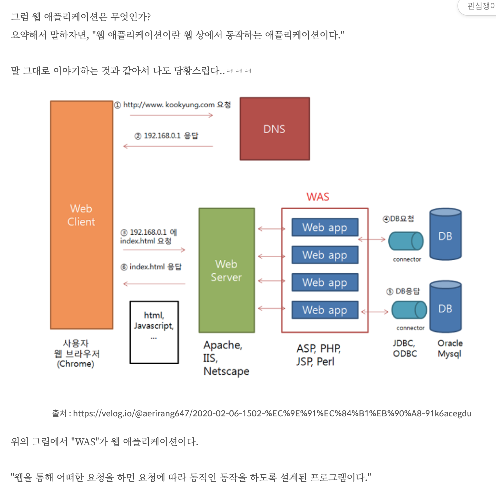

# Web : Springboot Basics

> Tue Aug 9

---

#### **웹 기본 구조**

 

사용자와 서버로 나누어 생각해보자!

 

우리가 네이버에서 "뉴스" 버튼을 클릭하면 뉴스 화면으로 이동한다.

실제로 내부에서는 어떻게 이루어질까??

다음을 보면서 이해해보자!

 

1. 사용자가 "뉴스" 버튼을 클릭한다.
2. 사용자의 웹 브라우저가 요청 메시지를 보낸다. (ex. naver.com/news)
3. naver.com가 DNS를 거쳐 naver의 ip주소로 변경되어 보내진다. (ex. 192.123.123/news)
4. 192.123.123/news 정보가 웹 애플리케이션 서버를 거쳐 http 메시지로 변경된다.
5. naver의 서블릿 컨테이너로 해당 http 메세지가 도착한다.
6. naver의 서블릿 컨테이너는 http 메세지를 읽고 그에 해당하는 내용을 사용자의 웹브라우저에게 돌려준다.
7. 사용자의 웹브라우저는 해당 내용을 읽고 사용자가 이용할 수 있게 변환해서 보여준다.

