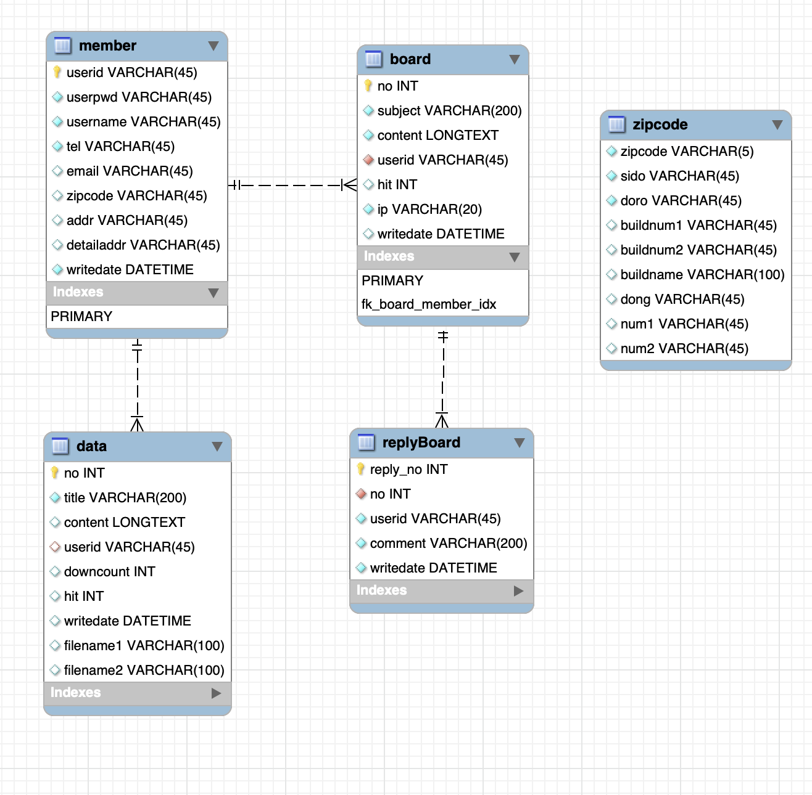

# Springboot: 게시판 댓글

> Fri Aug 5, 2022

---

[toc]


이번에는 게시판에 댓글을 다는 방법을 알아봅시다. Ajax 를 활용해서 만들어 봅시다.

댓글을 저장하기 위해서는 어떤 데이터가 필요할까요?

우선 일련번호, 글쓴이 (로그인 한 사람), 쓴 날짜, 내용이 필요하고 댓글을 단 게시물 번호가 반드시 있어야 합니다.


먼저 DB 를 설계하겠습니다. 테이블 이름은 ReplyBoard 로 지정하여 필요한 컬럼들을 만들겠습니다. 원래 글이 지워지면 안에 있던 댓글도 함께 지워지도록 설정 (cascade) 하겠습니다.





boardView.jsp 로 돌아와 댓글 폼을 작성합니다.

```jsp
	<!-- 댓글 -->
	<div>
		<form method="post" id="replyFrm">
			<!-- 원글 글번호 -->
			<input type="hidden" name="no" value="${vo.no }"/>
			<textarea maxlength="100" name="comment" id="comment" cols="50" rows="3"></textarea>
			<input type="submit" value="댓글쓰기"/>
		</form>
	</div>
```


이어서 댓글 리스트를 작성합니다.

```jsp
```


----

댓글을 쓴 본인만 수정, 삭제가 보여야겠죠? 
수정을 누르면 수정폼이 나오고 수정완료를 할 수 있도록,
삭제를 누르면 삭제할지 한번 더 물어보고 삭제할 수 있도록 해보겠습니다. 


Controller > DAO > Service > ServiceImpl > Mapper 순으로 메소드를 추가해나갑니다.

#### ReplyController.java

```java
package com.cali.myapp.controller;

import java.util.List;

import javax.servlet.http.HttpSession;

import org.springframework.beans.factory.annotation.Autowired;
import org.springframework.web.bind.annotation.GetMapping;
import org.springframework.web.bind.annotation.PostMapping;
import org.springframework.web.bind.annotation.RequestMapping;
import org.springframework.web.bind.annotation.RestController;

import com.cali.myapp.service.ReplyService;
import com.cali.myapp.vo.ReplyVO;

@RestController
@RequestMapping("/reply/*")
public class ReplyController {
	
	@Autowired
	ReplyService service;
	
	@PostMapping("replyWrite")
	public int replyWrite(ReplyVO vo, HttpSession session) {
		vo.setUserid((String)session.getAttribute("logId")); // 작성자
		
		return service.replyInsert(vo);
	}
	// 댓글목록 선택
	@GetMapping("replyList")
	public List<ReplyVO> replyList(int no){
		return service.replyList(no);
	}
	// 댓글수정
	@PostMapping("replyEdit")
	public int replyEdit(ReplyVO vo, HttpSession ses) {
		vo.setUserid((String)ses.getAttribute("logId"));
		return service.replyUpdate(vo);
	}
	// 댓글 삭제
	@GetMapping("replyDel")
	public int replyDel(int reply_no, HttpSession s) {
		String userid = (String)s.getAttribute("logId");
		return service.replyDelete(reply_no, userid);
	}
	
}

```


#### ReplyDAO.java

```java
package com.cali.myapp.dao;

import java.util.List;

import org.apache.ibatis.annotations.Mapper;
import org.springframework.stereotype.Repository;

import com.cali.myapp.vo.ReplyVO;

@Mapper
@Repository
public interface ReplyDAO {
	public int replyInsert(ReplyVO vo);
	public List<ReplyVO> replyList(int no);
	public int replyUpdate(ReplyVO vo);
	public int replyDelete(int reply_no, String userid);
}

```


#### ReplyService.java

```java
package com.cali.myapp.service;

import java.util.List;

import com.cali.myapp.vo.ReplyVO;

public interface ReplyService {
	public int replyInsert(ReplyVO vo);
	public List<ReplyVO> replyList(int no);
	public int replyUpdate(ReplyVO vo);
	public int replyDelete(int reply_no, String userid);
	
}

```


#### ReplyServiceImpl.java

```java
package com.cali.myapp.service;

import java.util.List;

import javax.inject.Inject;

import org.springframework.stereotype.Service;

import com.cali.myapp.dao.ReplyDAO;
import com.cali.myapp.vo.ReplyVO;

@Service
public class ReplyServiceImpl implements ReplyService {
	@Inject
	ReplyDAO dao;

	@Override
	public int replyInsert(ReplyVO vo) {
		return dao.replyInsert(vo);
	}

	@Override
	public List<ReplyVO> replyList(int no) {
		return dao.replyList(no);
	}

	@Override
	public int replyUpdate(ReplyVO vo) {
		return dao.replyUpdate(vo);
	}

	@Override
	public int replyDelete(int reply_no, String userid) {
		return dao.replyDelete(reply_no, userid);
	}

}

```


#### replyMapper.xml

```xml
<?xml version="1.0" encoding="UTF-8"?>
<!DOCTYPE mapper
  PUBLIC "-//mybatis.org//DTD Mapper 3.0//EN"
  "http://mybatis.org/dtd/mybatis-3-mapper.dtd">
<mapper namespace="com.cali.myapp.dao.ReplyDAO">
	<insert id="replyInsert">
		insert into replyBoard(no, userid, comment)
		values(#{no}, #{userid}, #{comment})
	</insert>
	<select id="replyList" resultType="ReplyVO">
		select reply_no, no, userid, comment, writedate
		from replyBoard
		where no={param1}
		order by reply_no asc
	</select>
	<update id="replyUpdate">
		update replyBoard set comment=#{comment}
		where reply_no=${reply_no} and userid=#{userid}
	</update>
	<delete id="replyDelete">
		delete from replyBoard where reply_no=${param1} and userid=#{param2}
	</delete>
</mapper>
```


---

이어서 게시판 리스트에서 각 댓글 수를 표시하는 방법을 알아봅시다.

생각보다 간단하게 mapper 내에서 서브쿼리를 사용하여 댓글 수를 구할 수 있습니다. 

이때 댓글갯수를 저장할 변수를 담을 VO 를 추가해주고

Mapper 로 돌아와 서브쿼리문을 작성하여 주면 됩니다.

```xml
	<select id="boardList" resultType="BoardVO">
		select b1.no, b1,subject, b1.userid, b1.hit, b1.writedate, b2.reply_count 
		from
		(select no, subject, userid, hit, date_format(writedate, '%m-%d %h:%i') writedate
		from board
		<if test="searchWord!=null">
			where ${searchKey} like '%${searchWord}%'
		</if>
		order by no desc
		limit ${onePageRecord} offset ${offsetPoint}) b1
		left outer join
		(select no, count(no) reply_count from replyBoard group by no) b2
		on b1.no=b2.no
	</select>
```

마지막으로 boardList 로 돌아와 댓글 수가 1이상일때만 표시하도록 추가해줍니다.

```jsp
<li><a href = "/board/boardView?no=${vo.no }&nowPage=${pvo.nowPage}<c:if test='${pvo.searchWord!=null }'>&searchKey=${pvo.searchKey }&searchWord=${pvo.searchWord }</c:if>">${vo.subject }</a>
					<!--  댓글수  -->
					<c:if test="${vo.reply_count>0 }">
						[${vo.reply_count}]
					</c:if>
				</li>
```

