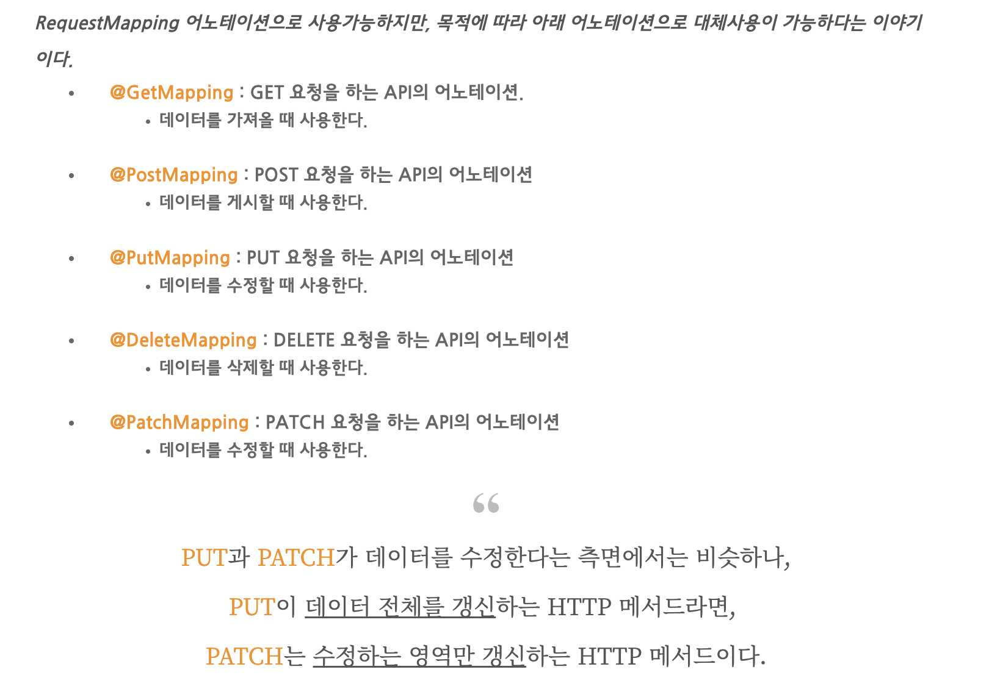

# Springboot: 프로젝트 셋업

> Fri Jul 29, 2022

---


Spring 은 메이븐 방식으로 pom.xml 에 작성하면 자동으로 다운로드가 되고 tomcat 을 서버로 사용합니다.

Springboot 은 maven 방식과 gradle 을 사용하고 내장된 서버를 사용합니다.

Mybatis (xml) > DAO > Controller > Service > VO > Views (.jsp) 의 구조는 동일합니다.

단지 차이는 서버를 maven, gradle 로 할 것인지만 정하면 됩니다. 


SpringBoot 를 다운받고 Create new Spring Starter Project 를 생성합니다. 

> Project Name: bootMybatisMysql
> Type: Gradle Project 
> Packaging: War
> Java Version: 11
> Group: com.cali
> Package: com.cali.myapp

다음으로 넘어가서 아래를 선택해줍니다.

> New Spring Starter Project Dependencies
>
> * Developer Tools: 
>   * Spring Boot DevTools, Lombok
> * SQL:
>   * JDBC API
>   * MyBatis Framework
>   * MySQL Driver
> * Web:
>   * Spring Web


src>main 에 webapp > WEB-INF > views 폴더를 새로 만듭니다.

뷰를 jsp로 사용하기 위해서 프레임워크를 추가해야합니다. 
메이븐저장소 > tomcat embed jasper > 9.0.58 > Gradle (Short) > 복사하여 build.gradle 을 열어 붙여넣습니다. 

추가로 JSTL, Inject (자동으로 객체 만들어줌) 을 검색해서 추가합니다.

```xml
	// 뷰를 jsp로 사용하기 위해서 프레임워크를 추가한다.
	// https://mvnrepository.com/artifact/org.apache.tomcat.embed/tomcat-embed-jasper
	implementation 'org.apache.tomcat.embed:tomcat-embed-jasper:9.0.58'

	// https://mvnrepository.com/artifact/javax.servlet.jsp.jstl/jstl
	implementation 'javax.servlet.jsp.jstl:jstl:1.2'

// https://mvnrepository.com/artifact/javax.inject/javax.inject
implementation group: 'javax.inject', name: 'javax.inject', version: '1'

```

pom.xml 은 저장만해도 자동으로 다운이 되지만 build.gradle 을 마우스 오른쪽을 눌러서 Gradle > Refresh Gradle Project 를 눌러줘야 다운이 됩니다.


---

src/main/resources 에 application.yml 을 하나 만듭니다. 이는 계층 적 구성 데이터를 지정하기위한 편리한 형식이며 DB 등의 정보를 이곳에서 관리 할 것입니다.


이어서 com.cali.myapp > ServletInitializer.java 에 코드를 추가합니다. 

> 왜 사용하나요?
>
> ​	


---

우선은 뷰페이지에 화면을 띄우기위해 기본적인 index.jsp, top.jspf, bottom.jspf 를 작성해보겠습니다. 


----

HTTP 이란?

> 인터넷상에서 데이터를 주고 받기 위한 약속


@RequestMapping("/login") 이란?

> - 요청에 대해 어떤 Controller, 어떤 메소드가 처리할지 맵핑하기 위한 어노테이션
> - 클래스나 메소드 선언부에 @RequestMapping 과 함께 URL 을 명시하여 사용
> - 요청 주소 (url) 설정, 요청 방식 (GET, POST, DELETE, PATCH) 설정
> - 요청방식들을 동시에 설정 가능 

```java
@RequestMapping(value="/test7", method={RequestMethod.GET, RequestMethod.POST})
```


@RequestParam 이란?

> 사용자가 원하는 매개변수에 값을 매핑하기 위해 사용합니다.


@GetMapping / @PostMapping 이란?

> 요청방식별로 제공되는 어노테이션
>
> 


@RestController 이란?

> 스프링프레임워크 4 버전 이상부터 사용 가능한 어노테이션으로 @Controller 에 @ResponseBody 가 결합된 어노테이션입니다. 
>
> @ResponseBody 를 생략하는 방법입니다.


@RequestBody 맵핑이란?

> 맵핑이란 단순히 값을 넣어줬다는 뜻으로 우리 시스템으로 날아온 형태(JSON)의 데이터를 JAVA 객체에 자동으로 값을 넣어주는 어노테이션이 @RequestBody 입니다. 

```java
@RestController
public class LoginController{
	
	@RequestMapping("/login")
	public LoginVO test(@RequestBody User user){
		LoginVO loginVo = userService.login(user);
		return loginVo;
	}

}
```


@ResponseBody 란?

> VO 객체를 JSON 으로 바꿔서 HTTP body 에 담는 스프링 어노테이션

```java
@ResponseBody
@RequestMapping(value="/test")
public LoginVO test() throws Exception{
  
  LoginVO loginVO = new LoginVO();
  loginVO.setId("admin");
  
  return loginVO;
}
```




---

### BoardList

게시판 리스트를 만들어봅시다.

#### DB설계


#### 처리조건

* DB 모델링 작성. 테이블명 board 로 설정
* 한 페이지에 5개의 레코드 표시
* 글제목 긴 경우 말줄임(...) 표시 스타일시트 적용
* 페이징 처리 구현, 한번에 표시할 페이즈 번호는 5개로 설정
* 검색어를 입력하여 검색기능 가능
* 전체선택 및 선택 삭제 가능


Views > board 폴더 생성 후 com.cali.myapp 에 각각의 패키지를 생성합니다. 

다음으로 board 폴더 아래에 boardList.jsp 파일을 하나 만들고 코드를 작성합니다. 

코드는 Top.jspf > boardController > boardMapper > BoardVO > BoardDAO > BoardService > BoardServiceImpl 순으로 작성합니다.


---

### BoardForm

게시판에 글쓰기 기능을 추가해보자.


### PagingVO

게시판 리스트를 페이징으로 만들어보자.


### BoardView

다음으로 게시글 클릭 시 해당 게시물로 넘어가는 기능을 추가해보자.

게시판 (boardList) 에서 리스트의 제목 (subject) 를 클릭하면 boardView 로 이동합니다. 

제목에는 searchWord, searchKey 조건문 필터를 걸어놓고 boardList 의 필터 및 검색 form (searchFrm) 을 submit 하면 찾을 수 있게 합니다.


목록으로 돌아가기 링크

```jsp
<a href = "/board/boardList?nowPage=${pvo.nowPage }<c:if test='${pvo.searchWord!=null }'>&searchKey=${pvo.searchKey }&searchWord=${pvo.searchWord }</c:if>">목록</a>
```


- [x] Controller 에 view 맵핑하기


```
- [ ] 이거는 곧 할 일입니다.
- [X] 완료 한 일입니다.
```


이때 조회수 증가도 함께 기능을 만들어줍니다.

- [x] hitCount 조회수 증가 - 증가 안됨


- [x] search 에 자바스크립트 걸기

boardList 에 자바스크립트 추가

```javascript
	$(function(){
		$("#searchFrm").submit(function(){
			if($("#searchWord").val()==""){
				alert("검색어를 입력하세요.);
				return false;
			}
			return true;
		});
```

boardMapper 에서 select 구문 수정

```jsp
	<select id="boardList" resultType="BoardVO">
		select no, subject, userid, hit, date_format(writedate, '%m-%d %h:%i') writedate
		from board
		<if test="searchWord != null">
			where ${searchKey} like '%${searchWord}%'
		</if>
		order by no desc
		limit ${onePageRecord} offset ${offsetPoint}
	</select>
```


- [ ] 게시물 썸네일 형식으로 바꾸기 (4x2)

Ul gall_list > li


- [x] 다운 받아서 합쳐보기

- [ ] 게시물 더미 데이터 찾고 추가하기
- [ ] [스프링으로 게시판에 이미지 업로드 하기](https://asfarasiknow.tistory.com/7)
- [ ] 


boardEdit 추가하기


### 스프링으로 게시판에 이미지 업로드하기

newsForm 에서 subject, content 를 작성하고 image 를 1-3개까지 올리면 form 을 submit 할 수 있습니다. 

성공적으로 submit 이 되면 newsFormOk 에 데이터를 게시합니다. 

userid 및 service.newsWriteOk(vo) 를 반환합니다. 


DB 에 사용될 VO 를  만들어놓고

Controller 에서 POST 요청으로 "newsFormOk" 에 데이터를 게시하는 코드를 추가하고

mapper 에서 id="newsWriteOk" 쿼리문을 만듭니다.

DAO > Service > ServiceImpl 순으로 메소드를 추가합니다. 


* newsForm 폼태그에 추가합니다. 
  `enctype="multipart/form-data"`


* DTO 로 넘기고자 하는 값을 하나씩 set 으로 입력시켜줍니다.
  `dto.setWriter(request.getParameter(""));`


```java
@PostMapping("/newsInsert")
	public String newsInsert(@RequestParam("file1") MultipartFile file , VboardVO vo , HttpServletRequest req, HttpServletResponse resp) {
		System.out.println(file);
		try {
		SimpleDateFormat sdf = new SimpleDateFormat("yyyyMMdd");
		Date date = new Date();
		String fileLoca = sdf.format(date);
		
		String uploadPath = req.getSession().getServletContext().getRealPath("/resources/images/thumbnail");
		
		System.out.println();
		File folder = new File(uploadPath);
		if(!folder.exists()) {
			folder.mkdir(); //폴더가 존재하지 않는다면 생성해라.
		}
		
		String fileRealName = file.getOriginalFilename();
		
		UUID uuid = UUID.randomUUID();
		String uuids = uuid.toString().replaceAll("-", "");
		
		String fileExtension = fileRealName.substring(fileRealName.indexOf("."), fileRealName.length());
		
		System.out.println("저장할 폴더 경로: " + uploadPath);
		System.out.println("실제 파일명: " + fileRealName);
		System.out.println("폴더명: " + fileLoca);
		System.out.println("확장자: " + fileExtension);
		System.out.println("고유랜덤문자: " + uuids);
		
		String fileName = uuids + fileExtension;
		System.out.println("변경해서 저장할 파일명: " + fileName);
		
		File saveFile = new File(uploadPath + "\\" + fileName);
	
			file.transferTo(saveFile);
			
			VboardVO Vvo = new VboardVO(0,vo.getVboard_title(),vo.getVboard_writer(), vo.getVboard_content() , 0, 0, vo.getVboard_type(), null, fileName, fileLoca, fileRealName, uploadPath, null,null,0,0);
			
				service.newsInsert(Vvo);

			} catch (IllegalStateException | IOException e) {
			e.printStackTrace();
		}
		
		
		//service.newsInsert(vo);
		return "redirect:/news/newsList";
	} 
	
	
```


```xml
<?xml version="1.0" encoding="UTF-8"?>
<!DOCTYPE mapper
  PUBLIC "-//mybatis.org//DTD Mapper 3.0//EN"
  "http://mybatis.org/dtd/mybatis-3-mapper.dtd">
<mapper namespace = "com.seu.app.dao.NewsDAO">
	<select id="newsList" resultType="NewsVO">
		select no, subject, userid, hit, date_format(writedate, '%m-%d %h:%i') writedate
		from news
		<if test="searchWord != null">
			where ${searchKey} like '%${searchWord}%'
		</if>
		order by no desc
		limit ${onePageRecord} offset ${offsetPoint}
	</select>
	<insert id="newsInsert">
		insert into news(no, subject, content, userid, name, hit, category, writedate, filename, fileloca, filerealname, uploadpath, file, material)
		values(#{no}, #{subject}, #{content}, #{userid}, #{name}, #{hit}, #{category}, #{writedate}, #{filename}, #{fileloca}, #{filerealname}, #{uploadpath}, #{file}, #{material})
	</insert>
	<select id="totalRecord" resultType="int">
		select count(no) cnt from news
		<if test='searchWord != null'>
			where ${searchKey} like '%${searchWord}%'
		</if>
	</select>
	<select id="getNews" resultType="NewsVO" parameterType="int">
		select no, subject, content, hit, date_format(writedate, '%M %d %Y') writedate
		from news
		where no = ${param1}
	</select>
	<update id="hitCount">
		update news set hit = hit + 1 where no = ${param1}
	</update>
		<delete id = "newsDel">
		delete from news where no = ${param1} and userid = #{param2}
	</delete>
	<update id = "newsEditOk" parameterType = "NewsVO">
		update news set subject = #{subject}, content = #{content} 
		where no = ${no} and userid = #{userid}
	</update>
</mapper>


```


BoardVO.java 를 생성합니다.

```java
package com.cali.myapp.vo;

public class BoardVO {
	private int no;
	private String subject;
	private String content;
	private String userid;
	private String ip;
	private int hit;
	private String writedate;
	
	@Override
	public String toString() {
		return "BoardVO [no=" + no + ", subject=" + subject + ", content=" + content + ", userid=" + userid + ", ip="
				+ ip + ", hit=" + hit + ", writedate=" + writedate + "]";
	}

	public int getNo() {
		return no;
	}

	public void setNo(int no) {
		this.no = no;
	}

	public String getSubject() {
		return subject;
	}

	public void setSubject(String subject) {
		this.subject = subject;
	}

	public String getContent() {
		return content;
	}

	public void setContent(String content) {
		this.content = content;
	}

	public String getUserid() {
		return userid;
	}

	public void setUserid(String userid) {
		this.userid = userid;
	}

	public String getIp() {
		return ip;
	}

	public void setIp(String ip) {
		this.ip = ip;
	}

	public int getHit() {
		return hit;
	}

	public void setHit(int hit) {
		this.hit = hit;
	}

	public String getWritedate() {
		return writedate;
	}

	public void setWritedate(String writedate) {
		this.writedate = writedate;
	}
	
	
}

```


BoardDAO.java 를 작성합니다.

```java
package com.cali.myapp.dao;

import java.util.List;

import org.apache.ibatis.annotations.Mapper;
import org.springframework.stereotype.Repository;

import com.cali.myapp.vo.BoardVO;

@Mapper
@Repository
public interface BoardDAO {
	// 글목록
	public List<BoardVO> boardList();
	// 글등록
	public int boardWriteOk(BoardVO vo);
	// 글선택(글수정), 글내용보기
	public BoardVO getBoard(int no);
	// 글수정
	public int boardEditOk(BoardVO vo);
	// 글삭제
	public int boardDel(int no, String userid);
	// 조회수
	public void hitCount(int no);
}

```


BoardDAO 에 있는 내용을 BoardService 에 옮겨줍니다. 저장하고 나서 BoardServiceImpl 로 가서 @Override 해줍니다.

```java
package com.cali.myapp.service;

import java.util.List;

import org.springframework.beans.factory.annotation.Autowired;
import org.springframework.stereotype.Service;

import com.cali.myapp.dao.BoardDAO;
import com.cali.myapp.vo.BoardVO;

@Service
public class BoardServiceImpl implements BoardService {
	@Autowired
	BoardDAO dao;

	@Override
	public List<BoardVO> boardList() {
		return dao.boardList();
	}

	@Override
	public int boardWriteOk(BoardVO vo) {
		return dao.boardWriteOk(vo);
	}

	@Override
	public BoardVO getBoard(int no) {
		return dao.getBoard(no);
	}

	@Override
	public int boardEditOk(BoardVO vo) {
		return dao.boardEditOk(vo);
	}

	@Override
	public int boardDel(int no, String userid) {
		return dao.boardDel(no, userid);
	}

	@Override
	public void hitCount(int no) {
		dao.hitCount(no);
	}

}

```


