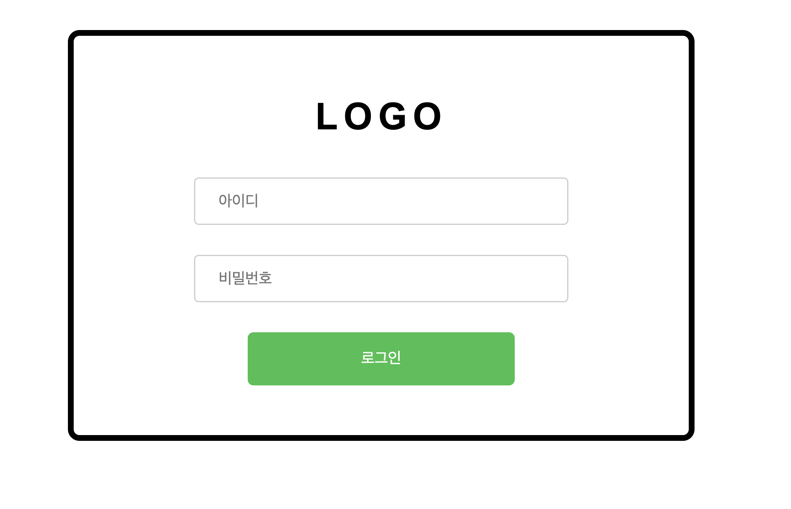

# 스프링부트 : 로그인

> Wed Aug 17, 2022

---

[toc]

### 1. DB 모델링


### 2. 로그인 폼화면 구현

* 아이디와 비밀번호의 입력유무를 확인하는 유효성 검사를 하도록 처리합니다.
* 아이디와 비밀번호를 이용하여 데이터베이스를 조회 후 로그인 성공 여뷰를 대화상자를 이용하여 표시하도록 만들어 줍니다.


#### build.gradle 

javax, jstl 과 jsp 를 뷰페이지로 사용하기 위한 dependencies 를 추가해줍니다. 


#### application.properties

포트번호, 뷰페이지 prefix/suffix, 데이터소스, 마이베티스의 정보를 입력해줍니다. 

```xml
server.port = 9090

# view prefix, suffix
spring.mvc.view.prefix=/WEB-INF/views/
spring.mvc.view.suffix=.jsp

# datasource
spring.datasource.driver-class-name=com.mysql.cj.jdbc.Driver
spring.datasource.url=mysql://127.0.0.1/practice?characterEncoding=utf-8
spring.datasource.username=root
spring.datasource.password=root1234

# mybatis
mybatis.type-aliases-package=com.cali.clova.vo
mybatis.mapper-locations=mapper/*Mapper.xml

```


#### 뷰페이지 폴더 생성

로그인 페이지를 생성하기 위해 src > main > webapp > WEB-INF > views > member > login.jsp 를 생성해줍니다.


#### home.jsp 생성

views > home.jsp 를 생성하여 홈화면을 생성하고 로그인 페이지 링크를 걸어줍니다.


#### HomeController 생성

HomeController 를 생성하고 서버 연결을 확인합니다.


home.jsp 에서 로그인 링크 (/member/login) 으로 이동

MemberController 에서 @RequestMapping("/member/login" ) 하여 "member/login" 으로 이동


#### jquery 로 유효성 검사

 


#### login DB

member/login 이 돌아오면 


#### Mapper 작성


### CSS

