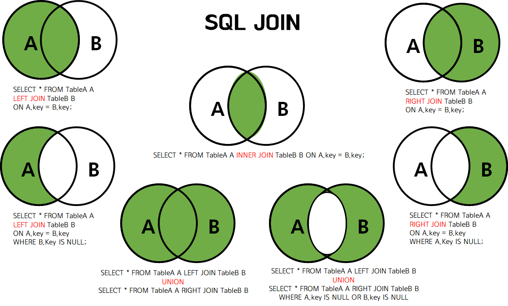

# Database: MySQL Join

> Fri Jul 1, 2022

---

[toc]




### Equi Join

```mysql
-- Query total salary, average salary of each department with deptno and dname
select d.deptno, d.dname, sum(e.sal) total_sal, round(avg(e.sal),2) avg_sal
from emp e join dept d on e.deptno = d.deptno
group by 1, 2
order by 4 desc;
```


### Non Equi Join

```mysql
-- 사원번호, 사원명, 급여, 호봉
select * from salgrade;
select * from emp;
select e.empno, e.ename, e.sal, s.grade
from emp e join salgrade s on e.sal between s.losal and s.hisal;
```

```mysql
-- Q. Query employees name, job, salary, grade that are in deptno 20 and 30.
select e.ename, e.job, e.sal, s.grade
from emp e join salgrade s on e.sal between s.losal and s.hisal
where deptno in (20, 30);
```

```mysql
-- 2개 이상의 테이블 조인
select e.ename, d.dname, e.sal, s.grade, e.deptno
from emp e 
join dept d on e.deptno = d.deptno
join salgrade s on e.sal between s.losal and s.hisal;
```


### Self Join

```mysql
select e.empno, e.ename, e.sal, e.mgr, m.ename mgr_name, m.sal mgr_sal
from emp e left join emp m on e.mgr = m.empno;
```


### Outer Join

```mysql
select e.empno, e.ename, d.dname, d.deptno
from emp e right outer join dept d on e.deptno = d.deptno;
```

