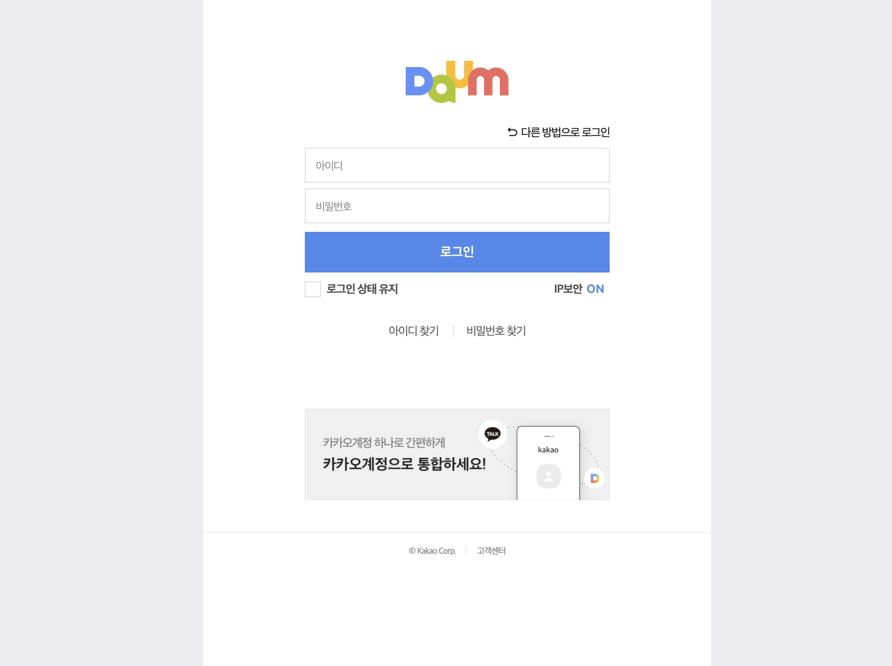

# Web: Cloning Daum Login Page

> Mon Jul 10, 2022

---

[toc]

다음 로그인 페이지를 크로닝 해보겠습니다.




```html
<!DOCTYPE html>
<html>
<head>
<meta charset="UTF-8">
<title>Daum 로그인</title>
<style>
	body{
		margin:0;
		background-color:#ddd;
	}
	#log_frm{
		width:470px;
		margin:0 auto;
		background-color:#fff;
		padding:100px 150px;
		border-bottom:1px solid #ddd;
	}
	#log_frm, footer{
		text-align:center;
	}
	#log_frm>img{
		margin-bottom:50px;
		width:180px;
		height:80px;
	}
	#log_frm>div>img{
		width:400px;
		height:120px;
	}
	#log_frm>#log{
		text-align:right;
		margin:10px 0px;
	}
	#log_frm form>input{
		width:100%;
		height:50px;
		margin:10px 0 10px;
	}
	#log_frm input[type=submit]{
		background-color:rgb(76, 135, 238);
		color:#fff;
		font-size:1.5em;
		border:0px;
	}
	#log_state>div{
		float:left;
		width:50%;
		margin: 10px 0px 20px;
	}
	#log_state>div:first-child{
		text-align:left;
	}
	#log_state>div:last-child{
		text-align:right;
	}
	#search{
		margin:30px 0;
	}
	footer{
		width:470px;
		padding:50px 150px;
		margin:0 auto;
		background-color:#fff;
		text-align:center;
	}
</style>
</head>
<body>
<div id="log_frm">
	
	<div id="log">
		다른 방법으로 로그인
	</div>
	<div>
		<form method="post" action="#" id="login">
			<input type="text" name="userid" id="userid"/><br/>
			<input type="password" name="userpwd" id="userpwd"/><br/>
			<input type="submit" value="로그인"/>
			<div id="log_state">
				<div>
					<input type="checkbox" id="logCheck"/> 로그인 상태 유지
				</div>
				<div>
					<span>IP보안</span> <span>ON</span>
				</div>
			</div>
		</form>
	</div>
	<div>
		아이디 찾기 | 
		비밀번호 찾기
	</div>
	<div>
		
	</div>
</div>
<footer>
	&copy;Kakao Corp | 고객센터
</footer>>
</body>
</html>
```


### CSS

img 태그에서 쓰이는 alt 속성

* 그림이 렌더링되지 못할 때 나타낼 문자열을 지정하기 위한 값입니다.


span 태그

* inline 으로 주어진 데이터만큼만 공간을 가지고 있는 태그입니다.
  줄넘김처리가 없습니다.


ul / ol 

* 순서 없는 / 있는 목록
* li 로 순서 생성


