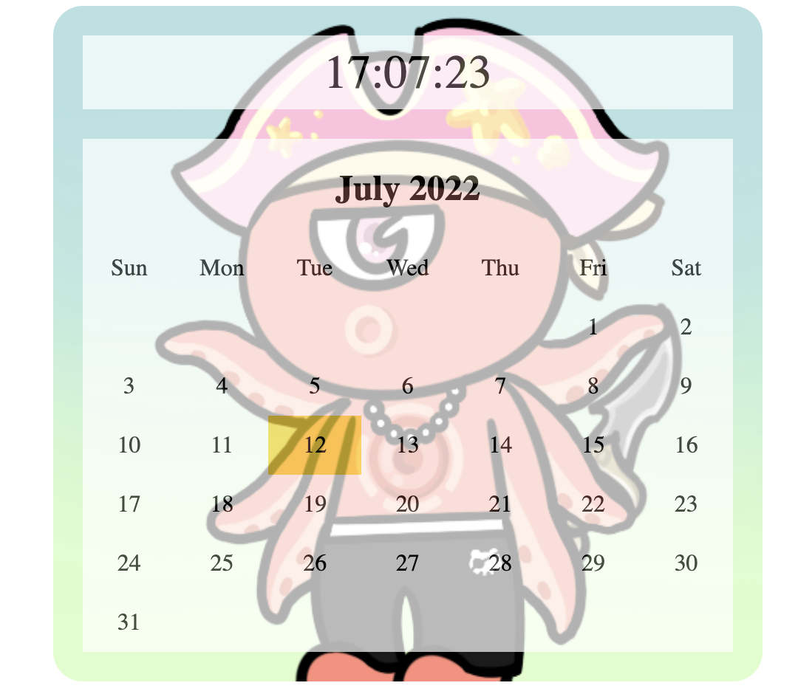

# JavaScript Ex: 달력만들기

> Tue Jul 12, 2022

---

아래의 달력을 만들어 봅시다.



```javascript
<!DOCTYPE html>
<html>
<head>
<meta charset="UTF-8">
<title>Insert title here</title>
<style>
	ul, li{
		margin:0; padding:0; list-style-type:none;
	}
	#mainCal{
		margin:10px auto;
		width:440px;
		padding:20px;
		background:url(../img/01.png) no-repeat;
		background-size:100% 500px;
		border-radius:20px;
	}
	#timer, #cal{
		background-color:#fff;
		opacity:0.7;
	}
	/* 시계 */
	#timer{
		font-size:2em;
		text-align:center;
		line-height:50px;
	}
	/* 달력 */
	#cal{
		overflow:auto;
		margin-top:20px;
	}
	#cal>h2{
		text-align:center;
		
	}
	#cal>ul>li{
		float:left;
		width:14.28%;
		text-align:center;
		line-height:40px;
	}
</style>
<script>
	var nowDate = new Date();
	// 시간을 세팅하기 위한 함수
	function setTimer(){
		var now = new Date();
		var h = now.getHours();
		var m = now.getMinutes();
		var s = now.getSeconds();
		
		var showTime = "";
		if(h<10) showTime += "0";
		showTime += h+":";
		if(m<10) showTime += "0";
		showTime += m+":";
		if(s<10) showTime += "0";
		showTime += s;
		
		document.getElementById("timer").innerHTML = showTime;
		
		// 배경이미지 변경
		var srcImage = imgName[s%imgName.length];
		document.getElementById("mainCal").style.backgroundImage = "url(../img/"+srcImage+")";
	}
	function setNowDate(){
		// 이번달 1일에 대한 요일
		var date = nowDate.getDate(); // 오늘날짜
		nowDate.setDate(1); // 1로 변경
		// 요일구하기
		var week = nowDate.getDay(); // 요일구하기
		var year = nowDate.getFullYear(); // 년도구하기
		var month = nowDate.getMonth()+1; // 월구하기
		
		nowDate = new Date(nowDate.getYear(), nowDate.getMonth()+1, 0);
		var lastDay = nowDate.getDate();
		
		// 출력할달력 만들기
		// var tag = "<h2>"+year+"년 "+month+"월</h2>";
		//var tag = "<h2>"+year+"년 "+nowDate.toLocaleString('default', {month: 'long'})+"월</h2>";
		var tag = "<h2>"+nowDate.toLocaleString('default', {month: 'long'})+" "+year+"</h2>";
		
		// 요일명 출력
		tag += "<ul><li>Sun</li><li>Mon</li><li>Tue</li><li>Wed</li><li>Thu</li><li>Fri</li><li>Sat</li>";
		// 공백
		for(var i=1; i<=week; i++){
			tag += "<li>&nbsp;</li>"
		}
		for(var d=1; d<=lastDay; d++){
			if(d==date){
				tag += "<li style='background:gold'>"+d+"</li>";
			}else{
				tag += "<li>"+d+"</li>";
			}
		}
		tag += "</ul>";
		console.log(tag);
		document.getElementById("cal").innerHTML = tag;
	}
	
</script>
</head>
<body onload="setInterval('setTimer()', 1000); setNowDate();">
<div id="mainCal">
	<div id="timer"></div>
	<script>
		setTimer();
	</script>
	<div id="cal"></div>
</div>
</body>
</html>
```

