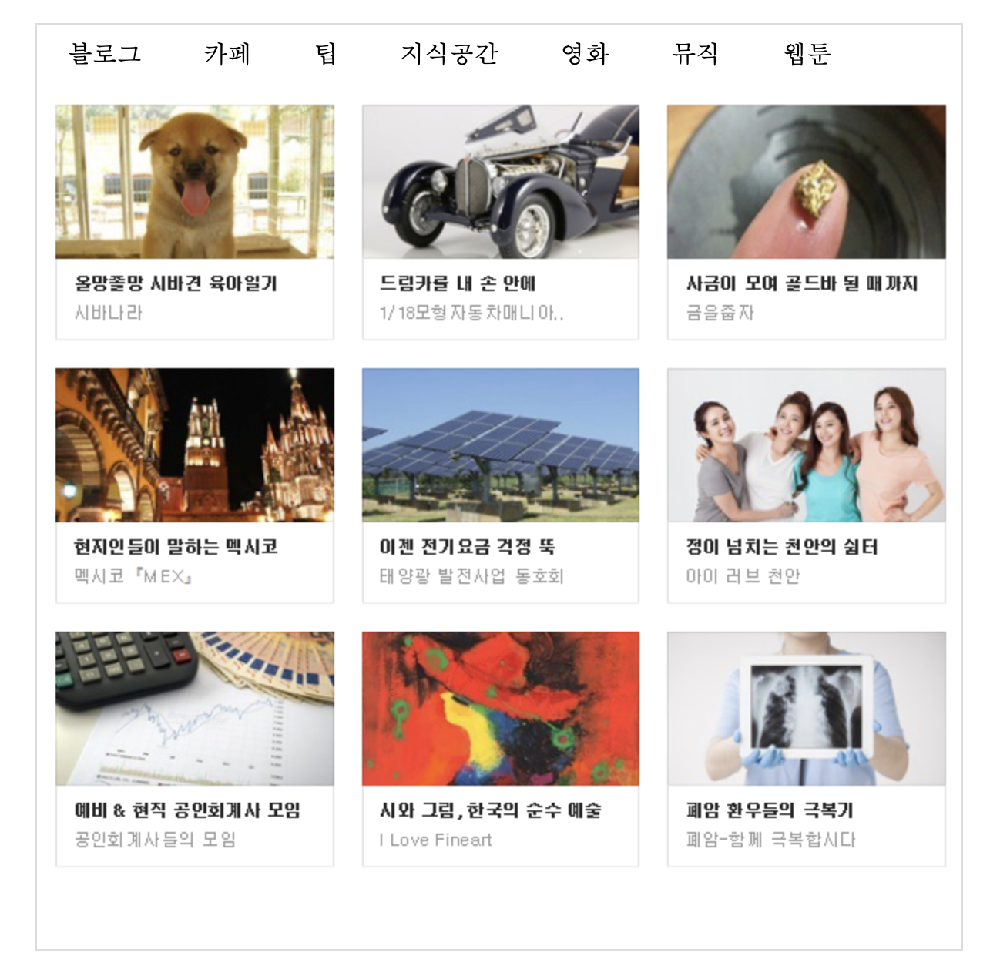

# JavaScript: 탭메뉴 만들기

> Jul 13, 2022

---

[toc]

탭메뉴를 만들어봅시다.


텍스트와 라디오 버튼을 연결하여 하나를 누르면 나머지는 모두 숨겨지게 만들겁니다. CSS 의 상태선택자를 활용할 수 있습니다.



### index.html

```javascript
<!DOCTYPE html>
<html>
<head>
<meta charset="UTF-8">
<title>Insert title here</title>
<style>	
	ul, li{
		margin: 0; padding:0; list-style-type:none;
	}
	#tabMenu{
		width:600px;
		height:600px;
		position:relative;
		border: 1px solid #ddd;
		margin:0 auto;
		overflow: hidden;
	}
	/* 메뉴 */
	#tabMenu>ul{ height:40px;}
	#tabMenu>ul>li{
		float: left;
		height: 40px;
		line-height: 40px;
		margin: 0px 20px;
	}
	#tabMenu>input[type=radio]{display:none;}
	
	/* 컨텐츠 */
	#tabMenu>div{
		position: absolute; left: 0px; top: 40px; display:none;
	}
	/* 선택한 radio 버튼에 해당하는 컨텐츠 보이도록 처리하기 */
	#m1:checked ~ div:nth-of-type(1){display:block;}
	#m2:checked ~ div:nth-of-type(2){display:block;}
	#m3:checked ~ div:nth-of-type(3){display:block;}
	#m4:checked ~ div:nth-of-type(4){display:block;}
	#m5:checked ~ div:nth-of-type(5){display:block;}
	#m6:checked ~ div:nth-of-type(6){display:block;}
	#m7:checked ~ div:nth-of-type(7){display:block;}
	
</style>
</head>
<body>
<h1>탭메뉴 만들기</h1>
<div id="tabMenu">
	<!-- 메뉴 -->
	<ul>
		<li><label for="m1">블로그</label></li>
		<li><label for="m2">카페</label></li>
		<li><label for="m3">팁</label></li>
		<li><label for="m4">지식공간</label></li>
		<li><label for="m5">영화</label></li>
		<li><label for="m6">뮤직</label></li>
		<li><label for="m7">웹툰</label></li>
	</ul>
	<!-- radio 버튼 -->
	<input type="radio" name="tMenu" id="m1" checked/>
	<input type="radio" name="tMenu" id="m2"/>
	<input type="radio" name="tMenu" id="m3"/>
	<input type="radio" name="tMenu" id="m4"/>
	<input type="radio" name="tMenu" id="m5"/>
	<input type="radio" name="tMenu" id="m6"/>
	<input type="radio" name="tMenu" id="m7"/>
	<!--  컨텐츠  -->
	<div></div>
	<div></div>
	<div></div>
	<div></div>
	<div></div>
	<div></div>
	<div></div>
	<div></div>
</div>
</body>
</html>
```

