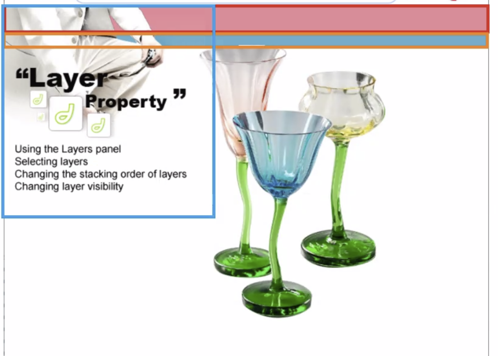

# JavaScript - jQuery: Ex 1

> Fri Jul 15, 2022

---

[toc]

아래의 웹을 jQuery 만을 이용해서 만들어봅시다. 



pink 색 div, 파란색 div, 사진 하나

사진 세개는 겹치게 가장 아래서부터 `eq()` 로 인덱스로 왼쪽, 위쪽 좌표를 지정할 수 있습니다.


```javascript
<!DOCTYPE html>
<html>
<head>
<meta charset="UTF-8">
<title>Insert title here</title>
<script src="https://cdnjs.cloudflare.com/ajax/libs/jquery/3.6.0/jquery.min.js"></script>
<script>
	$(function(){
		// body 의 여백 없애기
		$("body").css("margin", "0px");
		
		
		// body 에 div 하나 추가
		$("body").append("<div id='pinkDiv'/>");
		//높이를 정하고 배경색깔을 지정해주면 됩니다.
		$("#pinkDiv").css("height", "40px").css("background-color", "rgb(238, 135, 152)");
		
		// body 에 div 하나 더 추가
		$("body").append("<div id='blueDiv'/>");
		//높이를 정하고 배경색깔을 지정해주면 됩니다.
		$("#blueDiv").css("height", "22px").css("background-color", "rgb(84, 174, 200)");
		
		// title_layer 이미지 추가
		$("body").append("");
		// glass 이미지 반복문으로 추가
		var file = ['glass1.gif', 'glass2.gif', 'glass3.gif'];
		var tag = "";
		file.map(function(value, idx){
			tag += "";
		});
		$("body").append(tag);
		
		$("img").css("position", "absolute");
		// title_layer 이미지 top 좌표 잡기
		$("img:first").css("top", "0px");
		
		// 인덱스 1 사진을 위치 조정
		$("img").eq(1).css("left", "310px").css("top", "60px");
		$("img").eq(2).css("left", "450px").css("top", "100px");
		$("img").eq(3).css("left", "380px").css("top", "140px");
		//$("img:last").css("left", "380px").css("top", "200px");
		
	});
</script>
</head>
<body>

</body>
</html>
```

