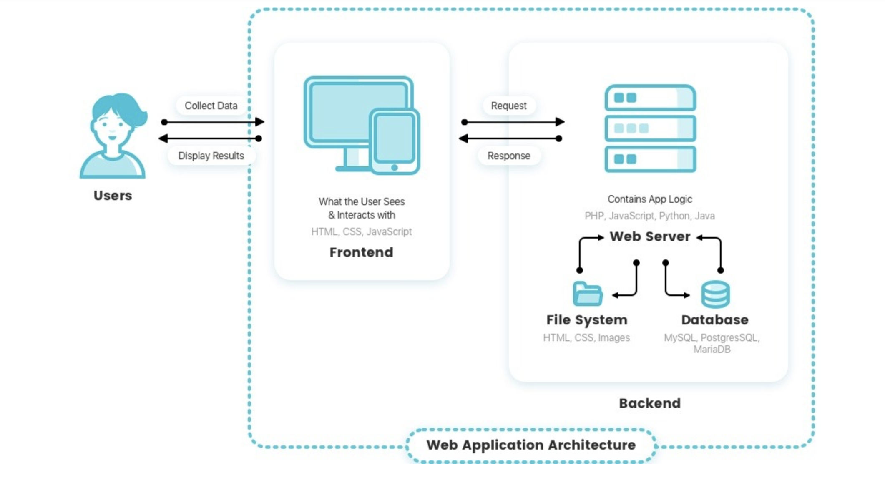

# JSP: Response

> Wed Jul 20, 2022

---

[toc]





### login.jsp

```jsp
<%@ page language="java" contentType="text/html; charset=UTF-8"
    pageEncoding="UTF-8"%>
<!DOCTYPE html>
<html>
<head>
<meta charset="UTF-8">
<title>Insert title here</title>
</head>
<body>
<h1>로그인</h1>
<form method="post" action="loginOk.jsp">
	Id : <input type="text" name="userid" id="userid"/><br/>
	Password : <input type="password" name="userpwd" id="userpwd"/><br/>
	<input type="submit" value="로그인"/>
</form>
</body>
</html>
```


### loginOk.jsp

```jsp
<%@ page language="java" contentType="text/html; charset=UTF-8" pageEncoding="UTF-8"%>
<%
	String userid = request.getParameter("userid");
	String userpwd = request.getParameter("userpwd");
	System.out.println(userid+", "+userpwd);

	// DB 조회
	if(userid.equals("goguma") && userpwd.equals("1234")){ // 로그인 성공
		// 다른페이지로 이동
		response.sendRedirect(request.getContextPath()+"/index.jsp");
	}else{ // 로그인 실패
		// response.sendRedirect("/webJSP/jsp02_response/login.jsp");
	%>
	<script>
		// document.write("로그인 실패");
		history.go(-2); // history.back(), history.forward(), history.go(정수)
	</script>
	<%
	}
%>
```

