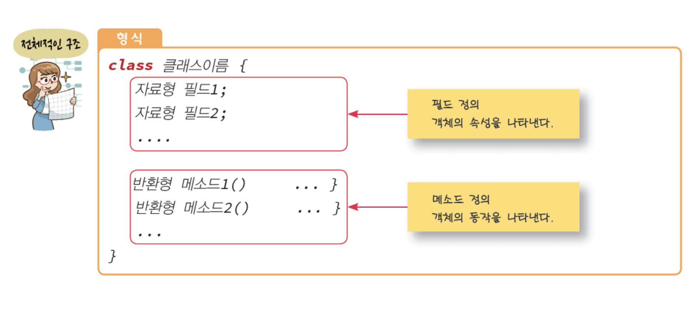
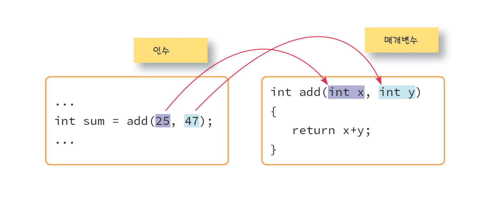

# Java Class

> Mon Jun 13, 2022

---

[toc] 

## 객체 지향 프로그래밍

> 부품에 해당하는 객체들을 먼저 만들고, 이것들을 하나씩 조립해서 완성된 프로그램을 만드는 기법 또는 실제 세계를 모델링하여 소프트웨어를 개발하는 방법

* **객체**는 물리적으로 존재하거나 추상적으로 생각할 수 있는 것 중에서 자신의 속성을 가지고 있고 다른 것과 식별 가능한 것을 말합니다.

* 객체는 **상태 (field)**와 **동작 (method)**을 가지고 있습니다.
  * 예) 자동자 객체
    * 상태: 색상, 모델명, 현재 기어, 현재 속도
    * 동작: 기어바꾸기, 감속하기, 가속하기


### 객체 지향의 3대 특징

* 캡슐화
* 상속
* 다형성


## 클래스

> 클래스 (class): 객체를 만드는 설계도
>
> 인스턴스 (instance): 클래스로부터 만들어지는 각각의 객체를 그 클래스의 인스턴스라고도 합니다.


### 클래스의 구조



### 객체의 필드와 메소드 사용

* 도트 (.) 연산자 사용


## 메소드

> 메소드는 입력을 받아서 처리를 하고 결과를 반환하는 가상적인 상자와 같습니다.


### 메소드의 구조


### 메소드의 종료

* return 을 사용합니다.

```java
void myMethod() {
	for(int i=0; i<10; i++){
		if(i == 7)
			return;
	}
}
```

* `return 반환값;` return 뒤에 수식을 적으면 수식의 값이 반환됩니다.


### 인수와 매개 변수

* 메소드 호출시 전달하는 값을 인수 (argument)
* 메소드에서 값을 받을 때 사용하는 변수를 매개 변수 (parameter)



### 오버로딩

> 같은 클래스내에서 같은 메소드명이 여러개 존재하는 것을 말합니다.
>
> 매개변수의 갯수나 데이터형이 달라야합니다.

```java

public class Overloading {
	
	public Overloading() {
		
	}
	
	// 오버로딩: 같은 클래스내에서 같은 메소드명이 여러개 존재하는 것을 말한다.
	//		   매개변수의 갯수나 데이터형이 달라야한다. 
	
	// 1~100까지 합
	public void sum() {
		System.out.println("1~100 까지의 합은 5050");
	}
	// 1~?까지의 합
	public void sum(int max) {
		int tot = 0;
		for(int i=1; i<=max; i++) {
			tot += i;
		}
		System.out.println("1~"+max+" 까지의 합은 "+tot);
	}
	// 1~?까지의 홀수 합
	public void sum(int max, String msg) {
		int tot = 0;
		for(int i=1; i<=max; i+=2) {
			tot += i;
		}
		System.out.println("1~"+max+" 까지의 홀수 합은 "+tot);
	}
	// 1~?까지의 짝수 합
	public void sum(String msg, int max) { // 매개변수의 순서가 달라도 가능
		int tot = 0;
		for(int i=2; i<=max; i+=2) {
			tot += i;
		}
		System.out.println("1~"+max+" 까지의 수 합은 "+tot);
	}
	
	
	public static void main(String[] args) {
		// Overloading 클래스를 객체로 만들어서 메소드 사용 
		Overloading o = new Overloading(); // 객체생성
		o.sum(343);
		o.sum(10, "Odd");

	}

}
```


## 상속 (Inheritance)

> 부모 객체는 자기가 가지고 있는 필드와 메소드를 자식 객체에게 물려주어 자식 객체가 사용할 수 있도록 해줍니다.


`public class Sedan extends Car{}`

* 상속관계에서 최상위는 Object 입니다.


## 추상클래스

