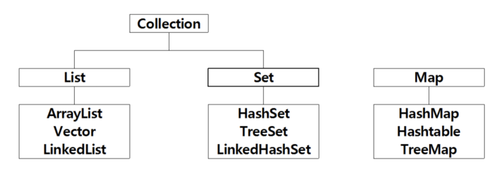
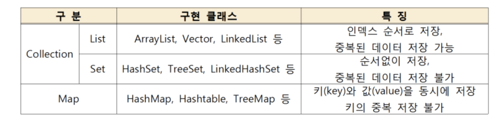
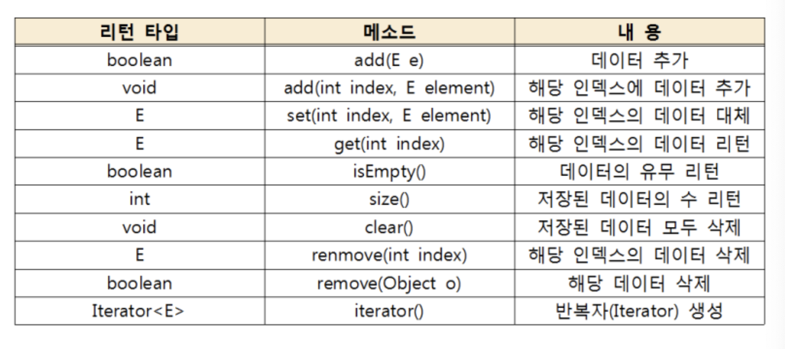

# Java Collection Framework - List

> Thu Jun 16, 2022

---

[toc] 

## Collection Framework (자료구조)

> 컬렉션이란 쉽게말해 데이터를 담을수 있는 주머니로, 객체나 데이터들을 효율적으로 관리(추가, 삭제, 검색, 저장)하기 위해서 사용하는 라이브러리를 의미합니다.





배열은 저장할 크기가 배열을 생성할 때 결정되어있어 배열의 크기가 넘어가면 저장이 불가능하죠. 
또한 데이터를 삭제하면 해당 인덱스의 데이터는 비워있는 구조를 갖는 등 여러 문제점이 발생됩니다.


이러한 문제점을 컬렉션 프레임워크를 통해서 해결이 가능합니다. 
java.util 패키지에 Collection 과 Map 인터페이스가 있습니다.

- Collection 인터페이스 상속받는 대표적인 인터페이스 List, Set

- Map 인터페이스를 상속받는 구현 클래스 HashMap, Hashtable, TreeMap


## List

> 인덱스 순서로 저장이 되며, 중복된 데이터 저장이 가능하고 데이터를 일렬로 늘어놓는 구조입니다.



### ArrayList

아래는 ArrayList 를 생성하는 방법입니다.

`List<E> 객체명 = new ArrayList<E>([초기 저장용량]);`

`List<String> list = new ArrayList<String>();`

* 초기 저장용량을 생략하면 기본적으로 10의 저장용량
* <E> 는 제네릭 타입이며 생략시 Object 타입이 됩니다.
* Object 은 모든 데이터 타입 저장 가능하지만 데이터 추가 및 검색시 형변환 필요합니다.


### Vector 

ArrayList 와 동일한 구조를 갖지만 Vector 는 자동 동기화를 보장하여 멀티 스레드 환경에 적합합니다.

`List<E> list = new Vector<e>([초기용량,</e> 증가용량]);`

* 초기용량과 증가용량을 생략하면 기본 값인 0


### LinkedList

다른 리스트 컬렉션과 다르게 인덱스가 아닌 인접한 곳을 링크하여 체인처럼 관리합니다. 중간에 데이터를 추가/삭제하는 경우 처리 속도가 빠릅니다.

FIFO (First-In First-Out) 은행 번호표같은 Queue 기능은 LinkedList 에 존재합니다. 양쪽에서 꺼내고 집어넣을수 있는 Deque 기능 역시 LinkedList 에 존재합니다.

`List<E> list = new LinkedList<E>();`


## Stack

```java
import java.util.Stack;

public class StackTest {

	public StackTest() {
		// Stack : 한쪽으로 객체를 담거나 꺼낸다. (FILO, LIFO)
		//		   객체를 꺼내면 Stack 영역에 지워진다. 
		
		Stack<String> s = new Stack<String>();
		s.push("John");
		s.push("MJ");
		s.push("Andrew");
		
		System.out.println("empty()->"+ s.empty()); // 객체가 있으면 False, 없으면 True
		System.out.println("size()->"+ s.size()); 
		
		while(!s.empty()) { // False
			System.out.println(s.pop());
			System.out.println("남은객체수->"+ s.size());
		}
		/// True

	}

	public static void main(String[] args) {
		
		new StackTest();

	}

}
```


## Generic

> 하나의 데이터 타입만 받을수 있다고 미리 선언하여 형변환없이 사용 가능

<E> 는 제네릭 타입이며 생략시 Object 데이터 타입입니다. 

* <K> -> Key
* <V> -> Value
* <E> -> Element (매개변수)

Object 은 모든 데이터 타입 저장 가능하지만 데이터를 가지고 나오거나, 데이터 추가 및 검색시 형변환 필요합니다.
만약 <T> 처럼 임의의 제너릭으로 선언하면 클래스 하나로 여러 타입의 데이터를 처리할 수 있습니다.


```java
public class ProductVO<T> {
	// 상품명을 저장하는 ___ 캡슐화
	private T productName;
	public ProductVO() {
		
	}
	public T getProductName() {
		return productName;
	}
	public void setProductName(T productName) {
		this.productName = productName;
	}

}
```


```java
public class GenericMain {

	public GenericMain() {
		ProductVO vo1 = new ProductVO();
		vo1.setProductName("Computer");
		
		vo1.setProductName(new MemberVO(1234, "AAA", "Strategy", "540-504-3234"));
		
		MemberVO vo = (MemberVO)vo1.getProductName();
		System.out.println(vo.toString());
	}
	public void start() {
		
	}

	public static void main(String[] args) {
		// 객체생성
		new GenericMain().start();

	}

}
```

